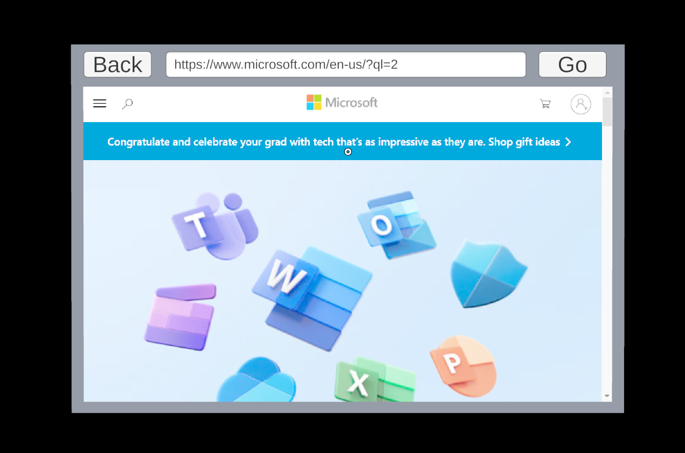

# Get started with WebView2 in HoloLens 2 Unity apps

> [!IMPORTANT]
> WebView2 continues to be available. However, support for WebView2 on Hololens is discontinued (no bug fixes, content updates or technical support), and we can therefore make no guarantees that applications will continue to work for any extended period of time.

This sample, **HoloLens2_GettingStarted**, is the completed Unity project that results from following the steps in the tutorial [Get started with WebView2 in HoloLens 2 Unity apps](https://learn.microsoft.com/microsoft-edge/webview2/get-started/hololens2).

Follow these steps to get started with this sample code. WebView2 is already included as a Unity package, but you will need to load it via the Mixed Reality Feature Tool.

1. Clone this repository
2. Launch the Microsoft Mixed Reality Feature Tool
    - Click **Start**
    - Click the **...** button, navigate to the `HoloLens2GetStartedApp` folder, and select **Open**
    - With the project path selected, click **Restore Features** to load the required packages for the Mixed Reality Toolkit and the WebView2 plugin package.
3. Close the Mixed Reality Feature Tool
4. Launch Unity Hub
5. In Unity Hub, click **Open**, navigate to the `HoloLens2GetStartedApp` folder, and select **Open**. This should open the project in the Unity Editor.
6. In the Unity Editor, find the SampleScene in the `Assets/Scenes` folder and double-click to load it.
7. Click the play button in the Unity Editor to quickly test the app.
