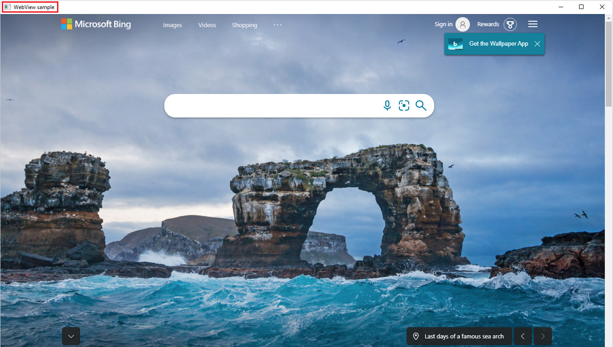

# Get started with WebView2 in Win32 apps

<!-- only enough info to differentiate this sample vs the others; what is different about this sample compared to the sibling samples? -->
This sample, **Win32_GettingStarted**, is a completed Visual Studio project that includes WebView2 code already added for you.  The tutorial [Get started with WebView2 in Win32 apps](https://learn.microsoft.com/microsoft-edge/webview2/get-started/win32) starts by opening this completed project.

