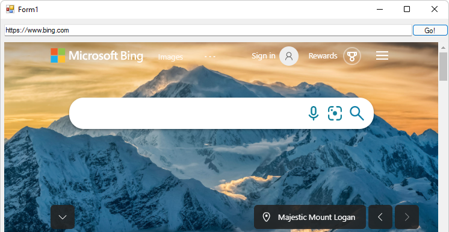

# Get started with WebView2 in WinForms apps

<!-- only enough info to differentiate this sample vs the others; what is different about this sample compared to the sibling samples? -->
This sample, **WinForms_GettingStarted**, is the completed Visual Studio project that results from following the steps in the tutorial [Get started with WebView2 in WinForms apps](https://learn.microsoft.com/microsoft-edge/webview2/get-started/winforms).

