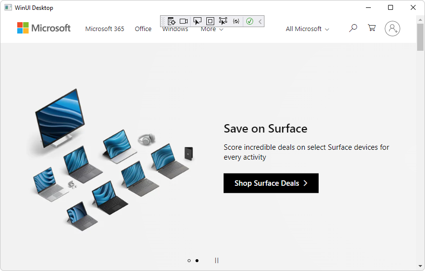

# Get started with WebView2 in WinUI 3 (Windows App SDK) apps

<!-- only enough info to differentiate this sample vs the others; what is different about this sample compared to the sibling samples? -->
This sample, **WinUI3_GettingStarted**, is the completed Visual Studio project that results from following the steps in the tutorial [Get started with WebView2 in WinUI 3 (Windows App SDK) apps](https://learn.microsoft.com/microsoft-edge/webview2/get-started/winui).

