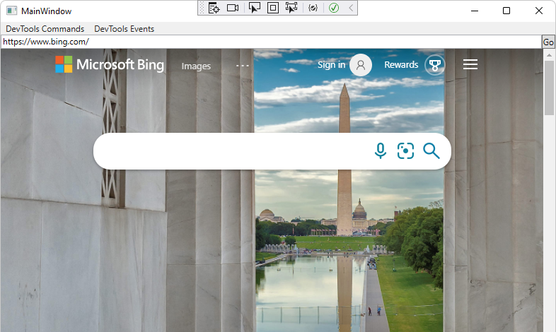

# WebView2 CDP Extension

<!-- only enough info to differentiate this sample vs the others; what is different about this sample compared to the sibling samples? -->
This sample, **WV2CDPExtensionWPFSample**, is built with the WebView2 CDP Extension.  This sample calls Chrome DevTools Protocol (CDP) methods on a `DevToolsProtocolHelper` object in WebView2.

This sample is built as a WPF Visual Studio 2019 project.  It uses C# in the WebView2 environment.

To use this sample, see [WPF sample app with CDP extension](https://learn.microsoft.com/microsoft-edge/webview2/samples/wv2cdpextensionwpfsample).

