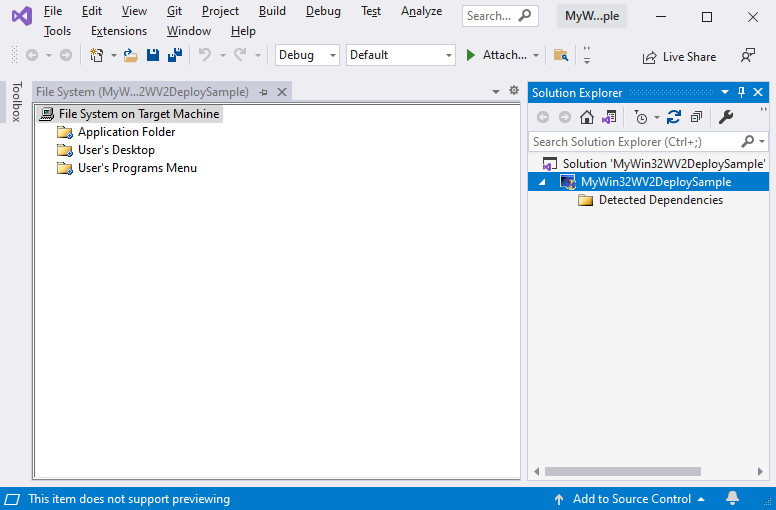

# WebView2 Deployment Visual Studio installer

<!-- only enough info to differentiate this sample vs the others; what is different about this sample compared to the sibling samples? -->
This sample, **WV2DeploymentVSInstallerSample**, demonstrates how to deploy the Evergreen WebView2 Runtime with your application.  This sample uses Microsoft Visual Studio Installer Projects to create an installer for the [WebView2APISample](../WebView2APISample//README.md) and chain-install the Evergreen WebView2 Runtime.

For more information, see [WebView2 Deployment Visual Studio installer](https://learn.microsoft.com/microsoft-edge/webview2/samples/wv2deploymentvsinstallersample).

