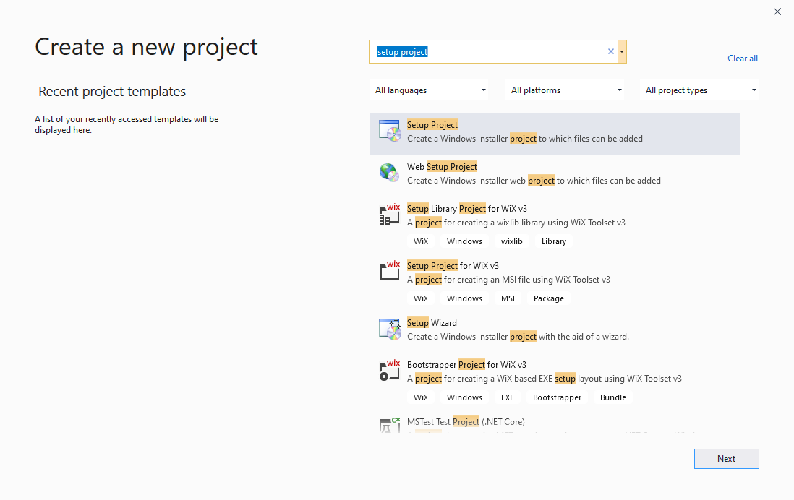
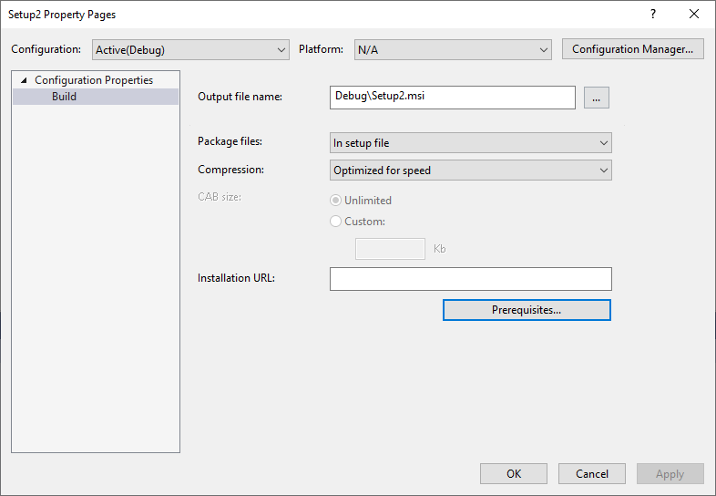
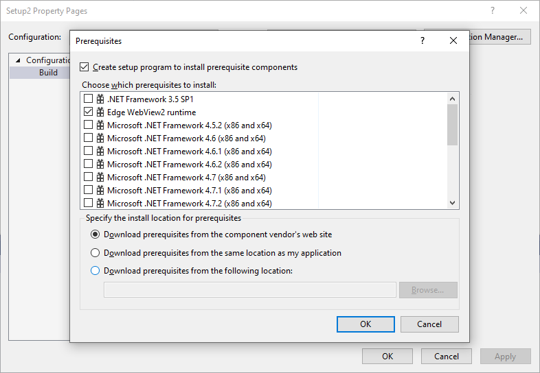

# WebView2 Deployment VS Installer Sample

To help developers understand how to [deploy the Evergreen WebView2 Runtime](https://docs.microsoft.com/microsoft-edge/webview2/concepts/distribution#deploying-the-evergreen-webview2-runtime) with your application, this sample uses the [Microsoft Visual Studio Installer Projects](https://marketplace.visualstudio.com/items?itemName=visualstudioclient.MicrosoftVisualStudio2017InstallerProjects) to create an installer for [WebView2APISample](./SampleApps/WebView2APISample/README.md) and chain-install the Evergreen WebView2 Runtime.

This sample showcases [deployment workflows](https://docs.microsoft.com/microsoft-edge/webview2/concepts/distribution#deploying-the-evergreen-webview2-runtime) for,

* Download the Evergreen WebView2 Runtime Bootstrapper through link.
* Package the Evergreen WebView2 Runtime Bootstrapper.
* Package the Evergreen WebView2 Runtime Standalone Installer.

## Prerequisites

* [Visual Studio](https://visualstudio.microsoft.com/vs/) with C++ support installed.
* [Microsoft Visual Studio Installer Projects](https://marketplace.visualstudio.com/items?itemName=visualstudioclient.MicrosoftVisualStudio2017InstallerProjects).

## Build steps

To create a VS installer that chain-install the Evergreen WebView2 Runtime,

1. Clone the repo.
1. Edit the `product.xml` file depending on the workflow you wish to use. 
    * For "Package the Evergreen WebView2 Runtime Bootstrapper",
        * Within the `<PackageFiles CopyAllPackageFiles="false">` and `</PackageFiles>` section, un-comment the line `<PackageFile Name="MicrosoftEdgeWebview2Setup.exe" />`, and comment out other lines.
        * Within the `<Commands Reboot="Defer">` and `</Commands>` section, make sure `PackageFile` points to `"MicrosoftEdgeWebview2Setup.exe"` so that the VS installer would be using the Bootstrapper.
    * For "Download the Evergreen WebView2 Runtime Bootstrapper through link",
        * Within the `<PackageFiles CopyAllPackageFiles="false">` and `</PackageFiles>` section, un-comment the line `<PackageFile Name="MicrosoftEdgeWebview2Setup.exe" HomeSite="WebViewRuntime" PublicKey="..."/>`, and comment out other lines. Note that the PublicKey for the WebView2 Runtime Bootstrapper may change without notice and we are working on addressing this issue. For now, you may need to replace it with an updated PublicKey.
        * Within the `<Commands Reboot="Defer">` and `</Commands>` section, make sure `PackageFile` points to `"MicrosoftEdgeWebview2Setup.exe"` so that the VS installer would be using the Bootstrapper.
    * For "Package the Evergreen WebView2 Runtime Standalone Installer",
        * Within the `<PackageFiles CopyAllPackageFiles="false">` and `</PackageFiles>` section, un-comment the line `<PackageFile Name="MicrosoftEdgeWebView2RuntimeInstallerX64.exe" />`, and comment out other lines.
        * Within the `<Commands Reboot="Defer">` and `</Commands>` section, make sure `PackageFile` points to `"MicrosoftEdgeWebView2RuntimeInstallerX64.exe"` so that the VS installer would be using the Standalone Installer.
        * If you're targeting non-X64 devices, you may also want to edit the `MicrosoftEdgeWebView2RuntimeInstallerX64` filename to reflect the correct architecture.
1. If you plan to package either the Bootstrapper or the Standalone Installer, [download](https://developer.microsoft.com/microsoft-edge/webview2/) the Bootstrapper or the Standalone Installer and place it under the `WV2DeploymentVSInstallerSample` folder.
1. Copy the entire `WV2DeploymentVSInstallerSample` folder, and paste it under either,
    * `Program Files (x86)\Microsoft SDKs\ClickOnce Bootstrapper\Packages\`, or
    * `<VS Install Dir>\MSBuild\Microsoft\VisualStudio\BootstrapperPackages\` (requires at least VS 2019 Update 7).
1. Create a Setup Project in Visual Studio. 
    * In Visual Studio menu, select `File > New > Project`. 
    * Search for `Setup Project`.
    
    * Create a Setup Project.
1. Add WebView2 Runtime as a prerequisite. 
    * In Visual Studio menu, select `Project > Properties`.
    * In the Property page, select `Prerequisites..`.
    
    * Check `Edge WebView2 runtime`, and un-check other prerequisites. Select `OK`.
    
1. Build the Setup project.
