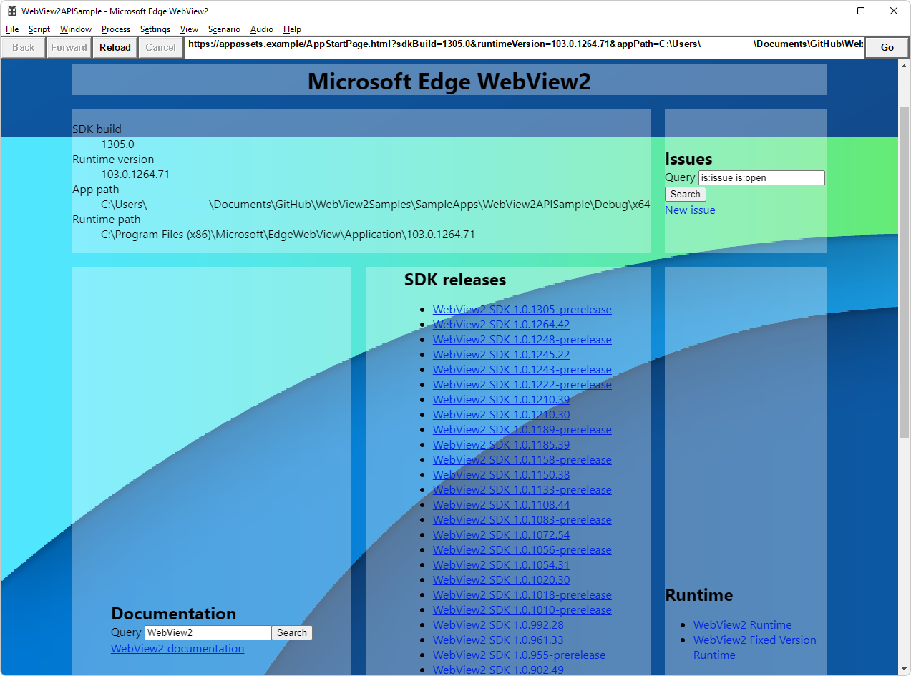
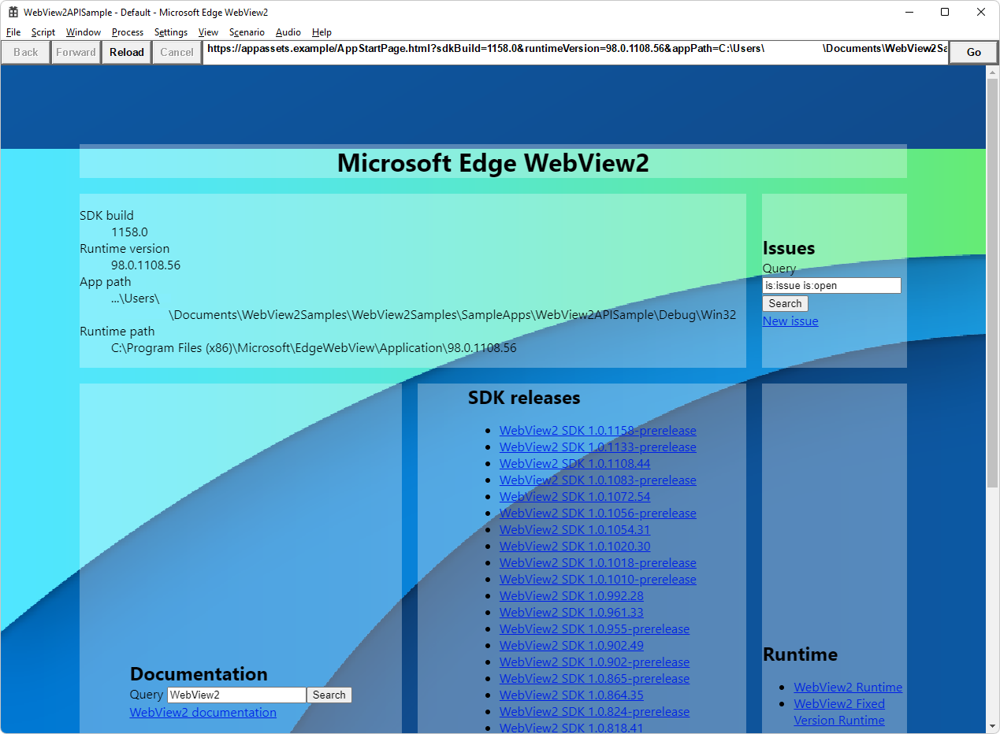

# Win32 sample app

<!-- only enough info to differentiate this sample vs the others; what is different about this sample compared to the sibling samples? -->
This sample, **WebView2APISample**, embeds a WebView2 control within a Win32 application.

This sample is built as a Win32 Visual Studio 2019 project.  It uses C++ and HTML/CSS/JavaScript in the WebView2 environment.

<!-- key distinction -->
The solution file for this sample is in the parent directory: `SampleApps/WebView2Samples.sln`.  The solution file includes a copy of some of the other, sibling samples for other frameworks or platforms.  This is the main sample; the Win32 sample app has several menus containing many menuitems that demonstrate a broad range of WebView2 APIs.

To use this sample, see [Win32 sample app](https://docs.microsoft.com/microsoft-edge/webview2/samples/webview2apissample).

Another version of the **WebView2APISample** app:

