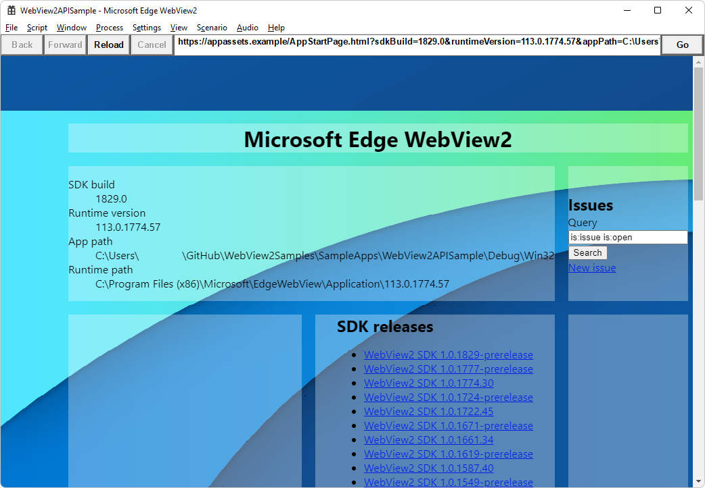

# Win32 sample app

<!-- only enough info to differentiate this sample vs the others; what is different about this sample compared to the sibling samples? -->

<!-- distinctive platform: -->
This sample, **WebView2APISample**, embeds a WebView2 control within a Win32 application.

<!-- distinctive project type and language: -->
This sample is built as a Win32 Visual Studio 2019 project.  It uses C++ and HTML/CSS/JavaScript in the WebView2 environment.

<!-- special notes about this particular sample: -->
The solution file for this sample is in the parent directory: `SampleApps/WebView2Samples.sln`.  The solution file includes a copy of some of the other, sibling samples for other frameworks or platforms.  

<!-- screenshot of running sample app: -->
This is the main WebView2 sample.  The running **WebView2APISample** app window shows the WebView2 SDK version and also the WebView2 Runtime version and path.  The **WebView2APISample** app has several menus containing many menuitems that demonstrate a broad range of WebView2 APIs:

<!-- link to regular docs: -->
To use this sample, see [Win32 sample app](https://docs.microsoft.com/microsoft-edge/webview2/samples/webview2apissample).
