# WebView2 API Testing Instructions

These are instructions for manually testing all the features of the WebView2 API using the WebView2APISample app.

## Table Of Contents

- [WebView2 API Testing Instructions](#webview2-api-testing-instructions)
  - [Table Of Contents](#table-of-contents)
  - [Getting started](#getting-started)
    - [Install a NuGet package Locally in VS](#install-a-nuget-package-locally-in-vs)
  - [UI Entries](#ui-entries)
    - [File](#file)
      - [Save Screenshot](#save-screenshot)
      - [Get Document Title](#get-document-title)
      - [Get Browser Version After Creation](#get-browser-version-after-creation)
      - [Get Browser Version Before Creation](#get-browser-version-before-creation)
      - [Exit](#exit)
    - [Script](#script)
      - [Inject Script](#inject-script)
      - [Inject Script With Result](#inject-script-with-result)
      - [Post Message string](#post-message-string)
      - [Post Message JSON](#post-message-json)
      - [Add/Remove Initialize Script](#addremove-initialize-script)
      - [Subscribe to CDP event \& Call CDP method](#subscribe-to-cdp-event--call-cdp-method)
      - [Open DevTools Window](#open-devtools-window)
    - [Window](#window)
      - [Close WebView](#close-webview)
      - [Create WebView](#create-webview)
      - [Create New Window](#create-new-window)
    - [Create New Window With Options](#create-new-window-with-options)
      - [Create New Thread](#create-new-thread)
    - [Process](#process)
      - [Browser Process Info](#browser-process-info)
      - [Crash Browser Process](#crash-browser-process)
      - [Unresponsive Browser Process](#unresponsive-browser-process)
    - [Settings](#settings)
      - [Blocked Domains](#blocked-domains)
      - [Set User Agent](#set-user-agent)
      - [Toggle JavaScript](#toggle-javascript)
      - [Toggle Web Messaging](#toggle-web-messaging)
      - [Toggle Fullscreen allowed](#toggle-fullscreen-allowed)
      - [Toggle Status Bar enabled](#toggle-status-bar-enabled)
      - [Toggle DevTools enabled](#toggle-devtools-enabled)
      - [Toggle ZoomControl enabled](#toggle-zoomcontrol-enabled)
      - [Toggle Pinch Zoom enabled](#toggle-pinch-zoom-enabled)
      - [Toggle Client Certificate Requested](#toggle-client-certificate-requested)
      - [Toggle Block images](#toggle-block-images)
      - [JavaScript Dialogs](#javascript-dialogs)
      - [Toggle context menus enabled](#toggle-context-menus-enabled)
      - [Toggle builtin error page enabled](#toggle-builtin-error-page-enabled)
    - [Toggle general autofill enabled](#toggle-general-autofill-enabled)
    - [Toggle password autosave enabled](#toggle-password-autosave-enabled)
    - [Toggle profile general autofill enabled](#toggle-profile-general-autofill-enabled)
    - [Toggle profile password autosave enabled](#toggle-profile-password-autosave-enabled)
    - [Toggle browser accelerator keys enabled](#toggle-browser-accelerator-keys-enabled)
      - [Toggle Swipe Navigation enabled](#toggle-swipe-navigation-enabled)
      - [Toggle SmartScreen enabled](#toggle-smartscreen-enabled)
      - [Toggle hide PDF toolbar items](#toggle-hide-pdf-toolbar-items)
      - [Toggle Allow External Drop](#toggle-allow-external-drop)
      - [Toggle Server Certificate Error](#toggle-server-certificate-error)
      - [Toggle Launching External URI Scheme](#toggle-launching-external-uri-scheme)
    - [View](#view)
      - [Toggle Visibility](#toggle-visibility)
      - [WebView Bounds Reference](#webview-bounds-reference)
        - [Bounds A](#bounds-a)
        - [Bounds B](#bounds-b)
        - [Bounds C](#bounds-c)
        - [Bounds D](#bounds-d)
      - [WebView Area](#webview-area)
      - [WebView Zoom](#webview-zoom)
      - [WebView Scale](#webview-scale)
      - [Set Focus](#set-focus)
      - [Tab In](#tab-in)
      - [ReverseTab In](#reversetab-in)
      - [Toggle Tab Handling](#toggle-tab-handling)
      - [WebView DefaultBackgroundColor](#webview-defaultbackgroundcolor)
    - [Scenario](#scenario)
      - [Web Messaging](#web-messaging)
      - [Host Objects](#host-objects)
      - [DOM Content Loaded](#dom-content-loaded)
      - [Script Debugging](#script-debugging)
        - [\[VSCode\] Debugging Setup](#vscode-debugging-setup)
        - [\[VSCode\] Single WebView JavaScript Debugging](#vscode-single-webview-javascript-debugging)
        - [\[VSCode\] Single WebView TypeScript Debugging](#vscode-single-webview-typescript-debugging)
        - [\[VSCode\] Single WebView JavaScript Debugging Using Attach](#vscode-single-webview-javascript-debugging-using-attach)
        - [\[VSCode\] Single WebView TypeScript Debugging Using Attach](#vscode-single-webview-typescript-debugging-using-attach)
        - [\[VS\] Single WebView JavaScript Debugging (Debugger For Microsoft Edge)](#vs-single-webview-javascript-debugging-debugger-for-microsoft-edge)
        - [\[VS\] Single WebView TypeScript Debugging (Debugger For Microsoft Edge)](#vs-single-webview-typescript-debugging-debugger-for-microsoft-edge)
      - [Cookie Management](#cookie-management)
      - [Cookie Management(Profile)](#cookie-managementprofile)
      - [NavigateWithWebResourceRequest](#navigatewithwebresourcerequest)
      - [ClientCertificateRequested](#clientcertificaterequested)
      - [SingleSignOn](#singlesignon)
      - [Clear Browsing Data](#clear-browsing-data)
      - [Print](#print)
      - [IFrame-Device-Permission](#iframe-device-permission)
      - [Accelerator Key Pressed IsBrowserAcceleratorKeyEnabled](#accelerator-key-pressed-is-browser-accelerator-key-enabled)
    - [Help](#help)
      - [About](#about)
    - [Dialogs](#dialogs)
      - [Download Dialog](#download-dialog)
      - [Find Dialog](#find-dialog)
    - [Dragging](#dragging)
      - [Draggable Regions](#draggable-regions)
      - [Interactive Dragging](#interactive-dragging)
      - [Drag and Drop](#drag-and-drop)
    - [Hosting Modes](#hosting-modes)
      - [Windowed Hosting](#windowed-hosting)
      - [Visual Hosting](#visual-hosting)
    - [Miscellaneous](#miscellaneous)
      - [Accelerator Key Support](#accelerator-key-support)
      - [Language](#language)
      - [Saving Password](#saving-password)
      - [Ctrl Cick a form with post method](#ctrl-cick-a-form-with-post-method)
      - [Open Link in New Window from PDF](#open-link-in-new-window-from-pdf)
      - [WebView Does Not Crash](#webview-does-not-crash)
      - [HTTPS upgrades disabled for API navigations](#https-upgrades-disabled-for-api-navigations)

## Getting started

- Install the [latest Edge Canary Channel](https://www.microsoftedgeinsider.com/download)

### Install a NuGet package Locally in VS

1. Open Visual Studio
2. Go to `View -> Other Windows -> Package Manager Console`
3. Select `WebView2APISample` as Default project
4. Run:

    ```powershell
    Install-Package <NuGet package file path>
    ```

5. Press `F5` to build and run the app.

## UI Entries

### File

#### Save Screenshot

Test that captures and saves a screenshot

1. Launch the sample app.
2. Go to `File -> Save Screenshot`
3. Expected: A file selection dialog with default file name `WebView2_Screenshot`, then save the screenshot of the WebView to the selected file
4. Expected: Preview Captured Message Box that says `Preview Captured`
5. Click `OK`

#### Get Document Title

Test that gets Document Title

1. Launch the sample app.
2. Go to `File -> Get Document Title`
3. Expected: Document Title Message Box that says `Bing`.
4. Click `OK` inside the popup dialog
5. Expected: dialog closed

#### Get Browser Version After Creation

Test that gets browser version after webview creation

1. Launch the sample app.
2. Go to `File -> Get Browser Version After Creation`
3. Expected: Message Box that contains browser version and channel name (if not stable and not Runtime) after WebView creation
4. Click `OK` inside the popup dialog
5. Expected: dialog closed

#### Get Browser Version Before Creation

Test that gets installed browser version before webview creation

1. Launch the sample app.
2. Go to `File -> Get Browser Version Before Creation`
3. Expected: Message Box that contains browser version and channel name (if not stable) before WebView creation
4. Click `OK` inside the popup dialog
5. Expected: dialog closed

#### Exit

Test that exits the sample app

1. Launch the sample app.
2. Go to `File -> Exit`
3. Expected: App Window and WebView closed

### Script

#### Inject Script

Test that prompts the user for some script to run in the WebView

1. Launch the sample app.
2. Go to `Script -> Inject Script`
3. Expected: Text Input Dialog that prompts the user for JavaScript code to execute in the current top level document rendered in the WebView
4. Click `Cancel`
5. Repeat steps 2-3
6. Type `confirm("Confirm?")` in the text input box and click `OK`
7. Expected: <www.bing.com> says popup that says `Confirm?`
8. Click `OK` inside the Confirm Box
9. Expected: dialog closed
10. Expected: ExecuteScript Result popup that says `true`
11. Click OK inside the popup dialog
12. Expected: dialog closed

#### Inject Script With Result

Test that prompts the user for some script to run in the WebView, and get the error reason when the execution fails

1. Launch the sample app.
2. Go to `Script -> Inject Script With Result`
3. Expected: Text Input Dialog that prompts the user for JavaScript code to execute in the current top level document rendered in the WebView
4. Click `Cancel`
5. Repeat steps 2-3
6. Type `"abc"` in the text input box and click `OK`
7. Expected: ExecuteScriptWithResult Json Result popup that says `"abc"`
8. Click OK inside the popup dialog
9. Expected: dialog closed
10. Expected: ExecuteScriptWithResult String Result popup that says `abc`
11. Click OK inside the popup dialog
12. Expected: dialog closed

#### Post Message string

Test that prompts the user for some string web message to the top level document

1. See [Web Messaging](#web-messaging)

#### Post Message JSON

Test that prompts the user for some JSON web message to the top level document

1. See [Web Messaging](#web-messaging)

#### Add/Remove Initialize Script

Test that prompts the user for some script to run as the initialization script

Test that prompts the user for the ID of the initialize scripts that the user would like to remove
_Scripts are executed after the global object has been created and before the HTML document has been parsed every navigation_

1. Launch the sample app.
2. Go to `Script -> Add Initialize Script`
3. Expected: Text Input Dialog that prompts the user for some JavaScript
4. Click `Cancel`
5. Repeat steps 2-3
6. Type `alert("Hello World!")` and click `OK`
7. Expected: Message Box with title `AddScriptToExecuteOnDocumentCreated ID` that contains the Script ID (e.g. 2)
8. Click `OK` inside the popup dialog and click `Reload`
9. Expected: Alert Box popup that says `Hello World!`
10. Click `OK` inside the Alert Box
11. Additional Alert Box may be generated depending on iframes, if so, click `OK` inside the Alert Box.
12. Load <https://aka.ms/webview2>
13. Repeat steps 9-10
14. Go to `Script -> Remove Initialize Script`
15. Expected: Text Input Dialog that prompts the user for Script ID
16. Click `Cancel`
17. Repeat steps 13-14
18. Type the Script ID from step 7 (e.g. 2) and click `OK`
19. Click `Reload`
20. Expected: No more Alert Box popup

#### Subscribe to CDP event & Call CDP method

Test that prompts the user for the name of the CDP event to subscribe to

Test that prompts the user for the CDP method name to call

1. Launch the sample app.
2. Go to `Script -> Call CDP method`
3. Expected: Text Input Dialog that prompts the user for the CDP method name (and parameters, if any) to call
4. Click `Cancel`
5. Repeat steps 2-3
6. Type `Page.enable` and click `OK`
7. Expected: CDP Method Result Message Box that says `{}`
8. Go to `Script -> Subscribe to CDP event`
9. Expected: Text Input Dialog that prompts the user for the name of the CDP event to subscribe to
10. Click `Cancel`
11. Repeat steps 7-8
12. Type `Page.javascriptDialogClosed` and click `OK`
13. Go to `Script -> Inject Script` and inject JavaScript `alert("Open!")`
14. Expected: Alert Box popup that says `Open!`
15. Click `OK` inside the Alert Box
16. Expected: Message Box with title `CDP Event Fired: Page.javascriptDialogClosed` that says `{"result":true,"userInput":"}` and ExecuteScript Result popup that says `null` (Side effect of `Script -> Inject Script`)
17. Click `OK` inside both popup dialogs

#### Open DevTools Window

Test that open DevTools in WebView window

1. Launch the sample app.
2. Go to `Script -> Open DevTools Window`
3. Expected: DevTools Window to pop up

### Window

#### Close WebView

Test that closes WebView

1. Launch the sample app.
2. Go to `Window -> Close WebView`
3. Expected: WebView closed.

#### Create WebView

Test that creates WebView with installed edge

1. Launch the sample app.
2. Go to `Window -> Create WebView`
3. Expected: WebView created with installed Edge

#### Create New Window

Test that creates new window

1. Launch the sample app.
2. Go to `Window -> Create New Window`
3. Expected: A new app window opened on the same thread

### Create New Window With Options

Test that creates new window with options

1. Launch the sample app.
2. Go to `Window -> Create New Window With Option`.
3. Type in profile name and uncheck InPrivate, then click `OK`.
4. Expected: A new app window opened with profile name in its title bar.
5. In sample app, repeat step 2.
6. Type in a different profile name as typed in step 3 and check InPrivate, then click OK.
7. Expected: A new app window opened with the different profile name in its title bar.
8. In sample app, repeat step 2.
9. Type in the same profile name as typed in step 3 but check InPrivate, then click OK.
10. Expected: A new window opened with the same profile name in its title bar and the app icon should be different that can indicate it's in private mode.

#### Create New Thread

Test that opens a new app window on a new thread

1. Launch the sample app.
2. Go to `Window -> Create New Thread`
3. Expected:  A new app window opened on a new thread

### Process

#### Browser Process Info

Test that gets browser process information

1. Launch the sample app.
2. Go to `Process -> Browser Process Info`
3. Expected: Process Info Message Box that contains the browser process ID
4. Click `OK` inside the popup dialog
5. Expected: The dialog closed

#### Crash Browser Process

Test browser process going away unexpectedly

1. Launch the sample app.
2. Go to `Process -> Crash Browser Process`
3. Expected: Error dialog popup that says `Browser process exited unexpectedly. Recreate webview?`\
  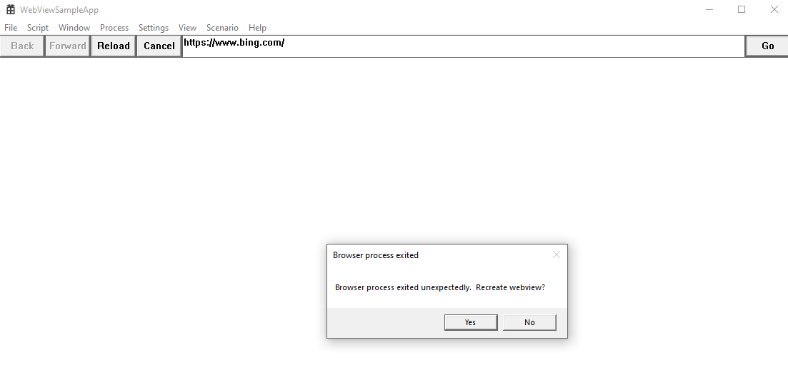
4. Click `Yes` inside the Popup dialog
5. Expected: The content from <https://www.bing.com> rendered inside the app, just like after step  1 above\
  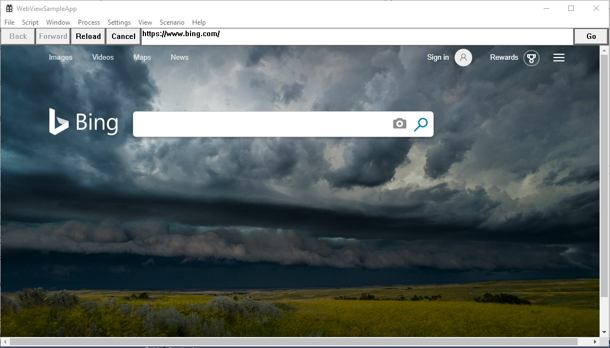
6. Repeat step 2-3, then click `No` inside the popup dialog
7. Expected: blank content inside the app\
  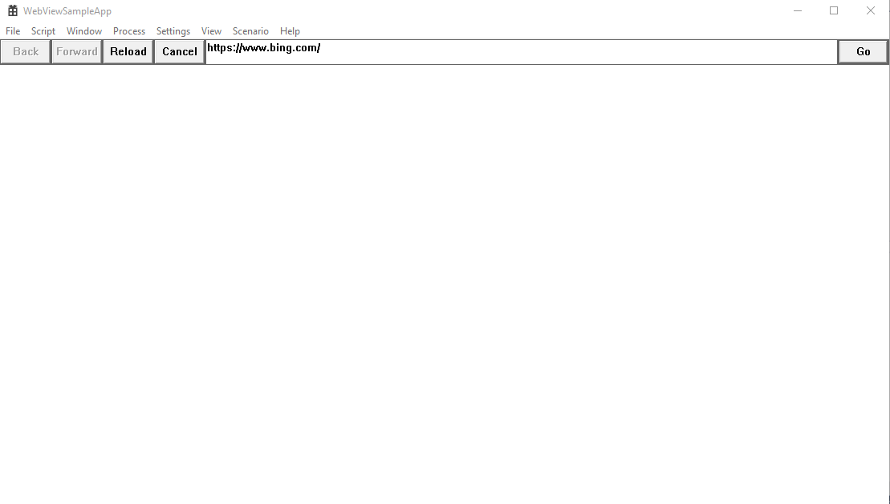

#### Unresponsive Browser Process

Test browser process becoming unresponsive

1. Launch the sample app.
2. Navigate to `edge://hang`.
3. Wait ~20-30 seconds.
4. Expected: Error dialog popup that says `Browser renderer process stopped responding. Recreate webview?` (note: an additional `Child process failed` popup might show. Close and ignore if it does.)\
  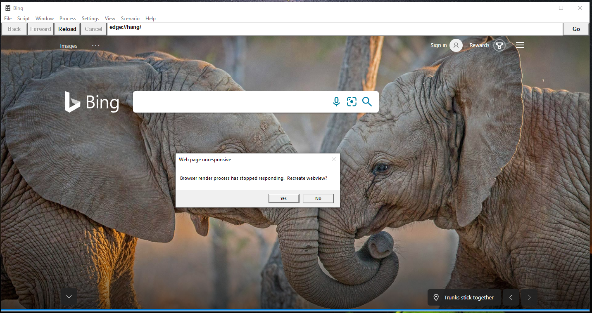
5. Click `Yes` inside the Popup dialog
6. Expected: The app window resets to the same state as step 1.

### Settings

#### Blocked Domains

Test that prompts user for sites to block
_It includes foo.com and bar.org by default_

1. Launch the sample app.
2. Load <https://www.microsoft.com>
3. Go to `Settings -> Blocked Domains`
4. Expected: Text Input Dialog that prompts the user for a list of blocked domains
5. Add <www.bing.com> to the list of blocked domains and click `OK`
6. Load <https://www.bing.com>
7. Expected: Navigation to <https://www.bing.com> fails
8. Repeat steps 3-4
9. Remove <www.bing.com> from the list of blocked domains and click `OK`
10. Repeat step 6
11. Expected: Navigation to <https://www.bing.com> completes

#### Set User Agent

Test that prompts the user for a new user agent string and sets user agent
_It only modifies the header for HTTP. Change won't be reflected if checked with `navigator.userAgent`_

1. Launch the sample app.
2. Go to `Settings -> Set User Agent`
3. Expected: Text Input Dialog that prompts the user for the user agent
4. Click `Cancel`
5. Repeat steps 2-3
6. Type `WebView Agent` and click `OK`
7. Load <https://www.whatismybrowser.com/detect/what-is-my-user-agent> (Use this third party site to verify)
8. Expected: See that User Agent is modified to `WebView Agent` accordingly
9. Repeat steps 2-3
10. Leave the input box blank to restore to default user agent and click `OK`
11. Expected: See that User Agent is restored to default

#### Toggle JavaScript

Test that enables/disables JavaScript
_It is enabled by default. `Script -> Inject Script` won't be affected if disabled._

1. Launch the sample app.
2. Expected: The JavaScript elements on <https://www.bing.com> are rendered accordingly
3. Go to `Settings -> Toggle JavaScript`
4. Expected: Message Box that says `JavaScript will be disabled after the next navigation.`
5. Click `OK` inside the popup dialog and click `Reload`
6. Expected: The JavaScript elements on <https://www.bing.com> are disabled
7. Repeat step 3
8. Expected: Message Box that says `JavaScript will be enabled after the next navigation.`
9. Repeat step 5
10. Expected: The JavaScript elements on <https://www.bing.com> are rendered again

#### Toggle Web Messaging

Test that enables/disables web messaging
_It is enabled by default._

1. Launch the sample app.
2. Go to `Scenario -> Web Messaging`
3. Go to `Settings -> Toggle Web Messaging`
4. Expected: Message box that says `Web Messaging will be disabled after the next navigation.`
5. Click `OK` inside the popup dialog and click `Reload`
6. Expected: Scenario in section `Posting Messages` wouldn't work
7. Repeat step 3
8. Expected: Message box that says `Web Messaging will be enabled after the next navigation.`
9. Repeat step 5
10. Expected: Scenario in section `Posting Messages` works as described

#### Toggle Fullscreen allowed

Test the allows/disallows Fullscreen mode
_It is allowed by default._

1. Launch the sample app.
2. Load [this sample video](https://www.youtube.com/watch?v=JE8KNQFwMzE&feature=youtu.be&t=943) and request it in full screen mode
3. Expected: The video element is allowed to be displayed full screen
4. Go to `Settings -> Toggle Fullscreen allowed`
5. Expected: Message box that says `Fullscreen is now disallowed.`
6. Click `OK`
7. Repeat step 2
8. Expected: The video element will fill the WebView bounds
9. Repeat step 4
10. Expected: Message box that says `Fullscreen is now allowed.`
11. Repeat steps 6-7
12. Expected: The video element is allowed to be displayed full screen again

#### Toggle Status Bar enabled

Test that enables/disables Status Bar
_It is enabled by default._

1. Launch the sample app.
2. Hover the cursor to the `Images` tab on <https://www.bing.com>
3. Expected: See status bar at the bottom left corner
4. Go to `Settings -> Toggle Status Bar enabled`
5. Expected: Message box that says `Status bar will be disabled after the next navigation.`
6. Click `OK` inside the popup dialog and click `Reload`
7. Repeat step 2
8. Expected: Status bar becomes unavailable
9. Repeat step 4
10. Expected: Message box that says `Status bar will be enabled after the next navigation.`
11. Repeat steps 6-7
12. Expected: Status bar comes back up the bottom left corner

#### Toggle DevTools enabled

Test that enables/disables DevTools
_It is enabled by default._

1. Launch the sample app.
2. Right-click the mouse
3. Expected: `Inspect` option available in the Right Click Menu
4. Go to `Settings -> Toggle DevTools enabled`
5. Expected: Message Box that says `Dev tools will be disabled after the next navigation.`
6. Click `OK` inside the popup dialog and click `Reload`
7. Right-click the mouse
8. Expected: `Inspect` option disappears in the Right Click Menu
9. Repeat step 4
10. Expected: Message Box that says `Dev tools will be enabled after the next navigation.`
11. Click `OK` inside the popup dialog and click `Reload`
12. Right-click the mouse
13. Expected: `Inspect` option available in the Right Click Menu again

#### Toggle ZoomControl enabled

Test that enables/disables Zoom
_It is enabled by default._

1. Launch the sample app.
2. Ctrl+ +/- or mouse wheel
3. Expected: The Webview zooms in and out, ZoomView shown below shouldn't show up:
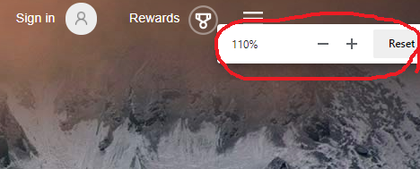
4. Go to `Settings -> Toggle zoom control enabled`
5. Expected: Message Box that says `Zoom control will be disabled after the next navigation.`
6. Click `OK` inside the popup dialog and click `Reload`
7. Ctrl+ +/- or mouse wheel
8. Expected: The Webview doesn't zoom in or out, nor ZoomView shows up
9. Go to `Settings -> Toggle zoom control enabled`
10. Expected: Message Box that says `Zoom control will be enabled after the next navigation.`
11. Verify that zooming works again, ZoomView should not show up

#### Toggle Pinch Zoom enabled

Test that enables/disables Pinch Zoom
_It is enabled by default._

1. Launch the sample app on a device with touch screen
1. Pinch zoom in/out
1. Expected: The web content in Webview zooms in and out, web content layout does not change but view port changes.
1. Go to `Settings -> Toggle pinch zoom enabled`
1. Expected: Message Box that says `Pinch Zoom is disabled after the next navigation.`
1. Click `OK` inside the popup dialog and click `Reload`
1. Pinch zoom in/out
1. Expected: The Webview content doesn't zoom in or out
1. Go to `Settings -> Toggle pinch zoom enabled`
1. Expected: Message Box that says `Pinch Zoom is enabled after the next navigation.`
1. Click `OK` inside the popup dialog and click `Reload`
1. Verify that pinch zooming works again.

#### Toggle Client Certificate Requested

Test that turns off client certificate selection dialog.
_It is disabled by default._

1. Launch the sample app.
2. Go to `Settings -> Toggle Client Certificate Requested`
3. Expected: Message Box that says `Custom client certificate selection has been enabled.`
4. Click `OK` inside the popup dialog.
5. Navigate to <https://client.badssl.com>.
6. Expected: Server responds with 400 Bad Request (No required SSL Certificate was sent) if client certificate is not installed on the user's machine.
7. Close the sample app.
8. Navigate to <https://badssl.com/download> from a browser to download client certificate required to access <https://client.badssl.com> site.\
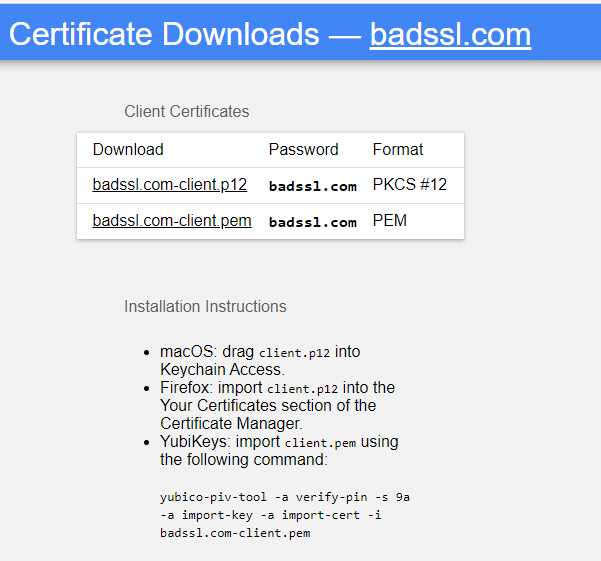
9. Click badssl.com-client.p12 from the list and confirm download has begun.
10. Go to the badssl.com-client certificate from the downloads.
11. Double click on the above downloaded badssl.com-client.p12 certificate. (Note: Make sure to click on the latest download, and not an old copy of it, as that can result in installing an expired certificate.)
12. Expected: Windows popup with title Certificate Import Wizard.\
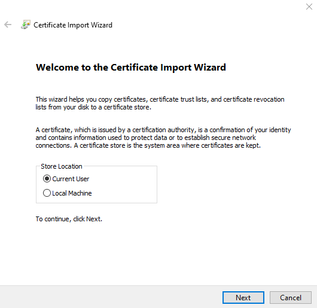
13. Select `Current User` from the store location in the popup and click `Next`.
14. Browse for the above downloaded client certificate location if not selected by default.
15. Click `Next`.
16. Type `badssl.com` in the password textbox and click `Next`.
17. Click `Next` again and click `Finish` button in the popup to finish certificate installation on Windows OS.
18. Expected: Message Box that says `The Import was successful.`
19. Click `Ok`.
20. Repeat steps 1-5 above.
21. Expected: Server authenticates the user and displays as below.\
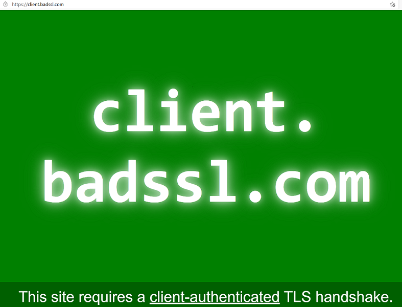

#### Toggle Block images

Test that enables/disables image blocking
_It is disabled by default. Data URI won't e affected if disabled._

1. Launch the sample app.
2. Go to `Settings -> Toggle Block images`
3. Expected: Message Box that says `Image blocking has been enabled.`
4. Click `OK` inside the popup dialog and click `Reload`
5. Expected: Images are blocked
6. Repeat step 2
7. Expected: Message Box that says `Image blocking has been disabled.`
8. Click `OK` inside the popup dialog and click `Reload`
9. Expected: No images are blocked

#### JavaScript Dialogs

Tests JavaScript Dialogs with different configurations

1. Launch the sample app
2. Go to `Settings -> JavaScript Dialogs -> Use Custom Script Dialogs`
3. Expected: Message Box that says `Custom script dialogs without deferral will be used after the next navigation.`
4. Click `OK` inside the popup dialog and click `Reload`
5. Go to `Script -> Inject Script` and inject JavaScript `alert()`
6. Expected: Custom Alert Box popup\
  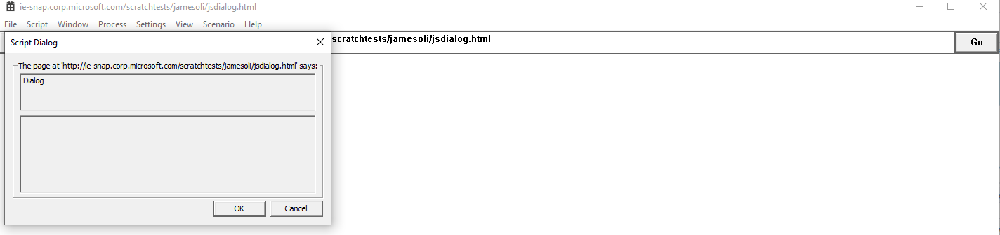
7. Make sure the default JavaScript Dialog does not show\
  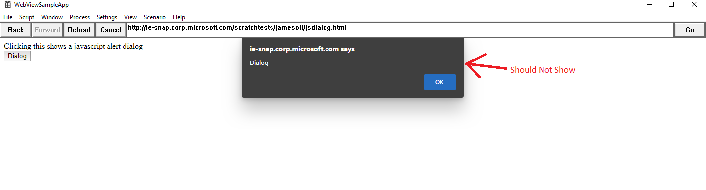
8. Click `OK` inside the Alert Box
9. Expected: ExecuteScript Result popup that says `null`
10. Go to `Settings -> JavaScript Dialogs -> Use Deferred Script Dialogs`
11. Expected: Message Box that says `Custom script dialogs with deferral will be used now.`
12. Repeat step 5
13. Expected: Nothing popups and WebView is frozen
14. Go to `Setting -> JavaScript Dialogs -> Complete Deferred Script Dialog`
15. Expected: Custom Alert Box popup
16. Click `OK` inside the Alert Box
17. Expected: ExecuteScript Result popup that says `null`
18. Go to `Settings -> JavaScript Dialogs -> Use Default Script Dialogs`
19. Expected: Message Box that says `Default script dialogs will be used after the next navigation.`
20. Click `OK` inside the popup dialog and click `Reload`
21. Repeat step 5
22. Expected: Default Alert Box popup
23. Click `OK` inside the Alert Box
24. Expected: ExecuteScript Result popup that says `null`

#### Toggle context menus enabled

Test that enables/disables context menu blocking
_Context menus are enabled by default._

1. Launch the sample app.
2. Go to `Settings -> Toggle context menus`
3. Expected: Message Box that says `Context menus will be disabled after next navigation.`
4. Click `OK` inside the popup dialog and click `Reload`
5. Right click on reloaded page
6. Expected: Nothing happens, no context menu shows up.
7. Go to `Settings -> Toggle context menus`
8. Expected: Message Box that says `Context menus will be enabled after next navigation.`
9. Click `OK` inside the popup dialog and click `Reload`
10. Right click on reloaded page.
11. Expected: Context menu shows up

#### Toggle builtin error page enabled

Test that enables/disables built-in error page
_Builtin error page is enabled by default._

1. Launch the sample app.
2. Go to `Settings -> Toggle built-in error page enabled`
3. Expected: Message Box that says `Built-in error page will be disabled for after the next navigation.`
4. Click `OK` inside the popup dialog
5. Try navigate to <https://www.bingaaa.com/>
6. Expected: blank page is shown
7. Go to `Process -> Crash Render Process`
8. Expected: WebView shows blank page and a dialog that says `Browser render process exited unexpectedly. Reload page?`
9. Click `Yes` in the popup dialog, expect webview to reload and stay as blank
10. Go to `Settings -> Toggle built-in error page enabled`
11. Expected: Message Box that says `Built-in error page will be enabled for after the next navigation.`
12. Click `OK` inside the popup dialog and click `Reload` button
13. Expected: error page is shown with `Hmmm… can't reach this page`
14. Go to `Process -> Crash Render Process`
15. Expected: error page is shown with `This page is having a problem` and a dialog that says `Browser render process exited unexpectedly. Reload page?`
16. Click `No` in the popup dialog, expect webview to stay at the error page

### Toggle general autofill enabled

Test that enables/disables general autofill
_General autofill is enabled by default._

1. Launch the sample app.
2. Navigate to <https://rsolomakhin.github.io/autofill/> (Use this third party site to verify).
3. Enter in any test information into the Profile Autofill section and click `Submit`.
4. Repeat step 2.
5. Click on the Name field.
6. Expected: A drop down box with the saved profile information is shown.
7. Click on the box.
8. Expected: The profile information is autofilled.
9. Go to `Settings -> Toggle General Autofill`
10. Expected: Message Box that says `General autofill will be disabled after the next navigation.`
11. Click `OK` inside the popup dialog and click `Reload`.
12. Repeat step 5.
13. Expected: No drop down box appears.
14. Repeat steps 3-5.
15. Expected: No drop down box appears.
16. Go to `Settings -> Toggle General Autofill`
17. Expected: Message Box that says `General autofill will be enabled after the next navigation.`
18. Click `OK` inside the popup dialog and click `Reload`.
19. Repeat step 5.
20. Expected: A drop down box with the original saved profile information from step 3 is shown.
21. Click on the box.
22. Expected: The profile information is autofilled.

### Toggle password autosave enabled

Test that enables/disables password autosave
 _Password autosave is disabled by default._

1. Launch the sample app.
2. Go to `Settings -> Toggle General Autofill`
3. Expected: Message Box that says `General autofill will be disabled after the next navigation.`
4. Click `OK` inside the popup dialog and click `Reload`.
5. Navigate to <https://rsolomakhin.github.io/autofill/> (Use this third party site to verify).
6. Enter in any test information into the Username/Password section and click `Submit`.
7. Expected: The app navigates to <https://example.com/> and no save password prompt is shown.
8. Repeat step 5.
9. Click on the username field.
10. Expected: No drop down box appears. (note: if password information has previously been saved when the password autosave has been enabled, a drop down box will appear.)
11. Go to `Settings -> Toggle Password Autosave`
12. Expected: Message Box that says `Password autosave will be enabled after the next navigation.`
13. Click `OK` inside the popup dialog and click `Reload`.
14. Repeat step 6.
15. Expected: The app navigates to <https://example.com> and a save password prompt will popup.
16. Click `Save`.
17. Repeat step 5.
18. Expected: See the username and password information is auto-populated.
19. Click on the username field.
20. Expected: A drop down box with the saved password information is shown.
21. Go to `Settings -> Toggle Password Autosave`
22. Expected: Message Box that says `Password autosave will be disabled after the next navigation.`
23. Click `OK` inside the popup dialog and click `Reload`.
24. Delete the information from the username and password fields and enter in new test information and click submit.
25. Expected: No save password prompt is shown.
26. Repeat step 5.
27. Expected: Only the information entered from step 14 is auto-populated.
28. Repeat step 9.
29. Expected: There is not an additional drop down box that has been added.

### Toggle profile general autofill enabled

Test that enables/disables profile general autofill
_General autofill is enabled by default._

1. Launch the sample app.
2. Go to `Window -> Create New Window With Option`.
3. Type in profile name and uncheck InPrivate, then click `OK`.
4. Expected: A new app window opened with profile name in its title bar, we call this window as window1.
5. In sample app, repeat step 2.
6. Type in the same profile name as typed in step 3 and uncheck InPrivate, then click OK.
7. Expected: A new app window opened with profile name in its title bar, we call this window as window2.
8. In sample app, repeat step 2.
9. Type in the same profile name as typed in step 3 but check InPrivate, then click OK.
10. Expected: A new window opened with the same profile name in its title bar and the app icon should be different that can indicate it's in private mode, we call this window as window3.
11. In all windows(1-3) navigate to <https://rsolomakhin.github.io/autofill/> (Use this third party site to verify).
12. In window1 enter in any test information into the Profile Autofill section and click `Submit`.
13. In window1 navigate to <https://rsolomakhin.github.io/autofill/>.
14. In all windows(1-3) click on the Name field.
15. Expected: A drop down box with the saved profile information is shown.
16. In all windows(1-3) click on the box.
17. Expected: The profile information is autofilled.
18. In window1 go to `Settings -> Toggle Profile General Autofill`.
19. Expected: Message box that says `General autofill will be disabled immediately in all WebView2 with the same profile.`.
20. Click `OK` inside the popup dialog.
21. In all windows(1-3) click on the Name field.
22. Expected: No drop down box appears.
23. Repeat step 12-14.
24. Expected: No drop down box appears.
25. In window1 go to `Settings -> Toggle Profile General Autofill`.
26. Expected: Message box that says `General autofill will be enabled immediately in all WebView2 with the same profile.`.
27. Click `OK` inside the popup dialog.
28. In all windows(1-3) click on the Name field.
15. Expected: A drop down box with the original saved profile information from step 12 is shown.
16. In all windows(1-3) click on the box.
17. Expected: The profile information is autofilled.

### Toggle profile password autosave enabled

Test that enables/disables password autosave
 _Password autosave is disabled by default._

1. Launch the sample app.
2. Go to `Settings -> Toggle Profile General Autofill`.
3. Expected: Message Box that says `General autofill will be disabled immediately in all WebView2 with the same profile.`.
4. Go to `Window -> Create New Window With Option`.
5. Type in profile name and uncheck InPrivate, then click `OK`.
6. Expected: A new app window opened with profile name in its title bar, we call this window as window1.
7. In sample app, repeat step 2.
8. Type in the same profile name as typed in step 3 and uncheck InPrivate, then click OK.
9. Expected: A new app window opened with profile name in its title bar, we call this window as window2.
10. In sample app, repeat step 2.
11. Type in the same profile name as typed in step 3 but check InPrivate, then click OK.
12. Expected: A new window opened with the same profile name in its title bar and the app icon should be different that can indicate it's in private mode, we call this window as window3.
13. In all windows(1-3) navigate to <https://rsolomakhin.github.io/autofill/> (Use this third party site to verify).
14. In window1 enter in any test information into the Username/Password section and click `Submit`.
15. Expected: The window1 navigates to <https://example.com/> and no save password prompt is shown.
16. In window1, navigate to <https://rsolomakhin.github.io/autofill/>.
17. In all windows(1-3) click on the username field.
18. Expected: No drop down box appears. (note: if password information has previously been saved when the password autosave has been enabled, a drop down box will appear.)
19. In window1, go to `Settings -> Toogle Profile Password Autosave`.
20. Expected: Message Box that says `Password autosave will be enabled after the next navigation in all WebView2 with the same profile.`.
21. Click `OK` inside the popup dialog.
22. In window1 enter in any test information into the Username/Password section and click `Submit`.
23. Expected: The app navigates to <https://example.com> and a save password prompt will popup.
24. Click `Save`.
25. In all windows(1-3) navigate to <https://rsolomakhin.github.io/autofill/>.
26. Expected: In window1 see the username and password information is auto-populated.
27. In all windows(1-3) click on the username field.
28. Expected: A drop down box with the saved password information is shown.
29. In window1 go to `Settings -> Toggle Profile Password Autosave`.
30. Expected: Message Box that says `Password autosave will be disabled after the next navigation in all WebView2 with the same profile.`.
31. Click `OK` inside the popup dialog.
32. In window1 delete the information from the username and password fields and enter in new test information and click submit.
33. Expected: No save password prompt is shown.
34. In window1 navigate to <https://rsolomakhin.github.io/autofill/>.
35. Expected: Only the information entered from step 22 is auto-populated.
36. In all windows(1-3) click on the username field.
37. Expected: There is not an additional drop down box that has been added.

### Toggle browser accelerator keys enabled

Test that enabled/disables browser accelerator keys
 _Browser accelerator keys are enabled by default._

1. Launch the sample app.
1. Go to `Settings -> Toggle browser accelerator keys enabled`
1. Expected: Message Box that says "Browser accelerator keys will be disabled after the next navigation.`
1. Click `OK` inside the popup dialog and click `Reload`.
1. Press `Ctrl-F` on the keyboard.
1. Expected: Nothing happens.
1. Click on a text box inside the webpage and press `Ctrl-A` then `Ctrl-X`.
1. Expected: The text in the text box is highlighted and then deleted as normal.
1. Go to `Settings -> Toggle browser accelerator keys enabled`
1. Expected: Message Box that says "Browser accelerator keys will be enabled after the next navigation.`
1. Click `OK` inside the popup dialog and click `Reload`.
1. Press `Ctrl-F` on the keyboard.
1. Expected: A search box appears in the upper-right corner of the webpage.

#### Toggle Swipe Navigation enabled

Test that enables/disables Swipe to navigate
_Swipe left/right to navigate is enabled by default._

1. Launch the sample app on a device with touch screen
1. Navigate to <https://www.bing.com>
1. Swipe right
1. Expected: WebView navigate back to the start up page
1. Swipe left
1. Expected: WebView navigate back to <https://www.bing.com>
1. Go to `Settings -> Toggle Swipe Navigation enabled`
1. Expected: Message Box that says `Swipe to navigate is disabled after the next navigation.`
1. Click `OK` inside the popup dialog and click `Reload`
1. Swipe right
1. Expected: WebView doesn't navigate on swipe left/right.
1. Go to `Settings -> Toggle Swipe Navigate enabled`
1. Expected: Message Box that says `Swipe to navigate is enabled after the next navigation.`
1. Click `OK` inside the popup dialog and click `Reload`
1. Verify that swipe to navigate works again.

#### Toggle SmartScreen enabled

Test that enables/disables SmartScreen

1. Launch the sample app
1. Navigate to <https://nav.smartscreen.msft.net/other/areyousure.html>
1. Expected: The SmartScreen pop-up window will appear
1. Go to `Settings -> Toggle Profile Smart Screen`
1. Expected: Message Box that says `SmartScreen is disable after the next navigation.`
1. Refresh the page
1. Expected: The popup will no longer appear
1. Go to `Window -> Create New Window`
1. Expected:A new window will be created
1. Navigate both windows to <https://nav.smartscreen.msft.net/other/areyousure.html>
1. Expected: The SmartScreen pop-up window will appear in both windows
1. In the second window, go to `Settings -> Toggle Profile Smart Screen`
1. Expected: Message Box that says `SmartScreen is disable after the next navigation.`
1. Refresh the pages of both windows.
1. Expected: The pop-up window of SmartScreen will not appear on both windows
1. In the second window,go to `Settings -> Toggle Profile Smart Screen`
1. Expected: Message Box that says `SmartScreen is enable after the next navigation.`
1. Refresh the page
1. Expected: The SmartScreen pop-up window will appear in both windows
1. Close the second window
1. First window navigate to <https://nav.smartscreen.msft.net/other/areyousure.html>
1. Expected: The popup will no longer appear

#### Toggle hide PDF toolbar items

Test that hide/show PDF save button and print button.

1. Launch the sample app
1. Navigate to <https://query.prod.cms.rt.microsoft.com/cms/api/am/binary/RE2PjDI>
1. Expected: The save button and print button is on the toolbar
1. Go to `Settings -> Toggle hide pdf toolbar items`
1. Refresh the page
1. Expected: The save button and print button is not on the toolbar
1. Go to `Settings -> Toggle hide pdf toolbar items`
1. Refresh the page
1. Expected: The save button and print button is on the toolbar again

#### Toggle Allow External Drop

Test that enables or disables dragging and dropping files into webview.

1. Launch the sample app.
1. Drag and drop a file(e.g. txt file) into the sample app
1. Expected: A new window with this text file opened is launched
1. Go to `Settings -> Toggle Allow External Drop`
1. Drag and drop the file into the sample app again
1. Expected: The drag and drop action is disabled and no new window is launched
1. Go to `Settings -> Toggle Allow External Drop`
1. Drag and drop the file into the sample app again
1. Expected: A new window with this text file opened is launched

#### Toggle Server Certificate Error

Test that turns off TLS error page.

1. Launch the sample app.
1. Navigate to <https://self-signed.badssl.com>.
1. Expected: WebView2 displays SSL error page to the user.
1. Go to `Settings -> Server Certificate Error -> Toogle Server Certificate Error Support`.
1. Expected: Message Box that says `Custom server certificate error support been enabled`.
1. Click `OK` inside the popup dialog.
1. Refresh the page.
1. Expected: Web page is loaded without any errors.
1. Go to `Settings -> Server Certificate Error -> Toogle Server Certificate Error Support`.
1. Expected: Message Box that says `Custom server certificate error support been disbaled`.
1. Go to `Settings -> Server Certificate Error -> Clear Server Certificate Error Actions`.
1. Expected: Message Box that says `Clear server certificate error actions are succeeded.`
1. Refresh the page.
1. Expected: WebView2 displays SSL error page to the user.

#### Toggle Launching External URI Scheme

1. Launch the sample app.
1. Navigate to <calculator://>.
1. Expected: Default dialog is displayed.
1. Select `OK` inside the dialog.
1. Expected: Calculator application is launched.
1. Go to `Settings -> Toggle Launching External URI Scheme`.
1. Expected: Message Box that says `Launching Exteranl URI Scheme support has been enabled`.
1. Click `OK` inside the popup dialog.
1. Repeat step 2.
1. Expected: No default dialog is displayed and the calculator application is launched.
1. Go to `Settings -> Toggle Launching External URI Scheme`.
1. Expected: Message Box that says `Launching Exteranl URI Scheme support has been disabled`.
1. Repeat step 2.
1. Expected: Default dialog is displayed.

### View

#### Toggle Visibility

Test that makes WebView visible/invisible

1. Launch the sample app.
1. Go to `View -> Toggle Visibility`
1. Expected: The WebView becomes invisible
1. Repeat step 2
1. Expected: The WebView becomes visible

#### WebView Bounds Reference

Notes:

- Top is always 32 (or some non-zero value) to account for sample app UI such as menu bar and address bar
- WebView height is (Bottom - Top)
- WebView width is equal to Right

##### Bounds A

Left: 0
Top: 32
Right: 1424
Bottom: 700

or, the default WebView bounds before any scaling/resizing

##### Bounds B

Left: 0
Top: 32
Right: 712
Bottom: 366

or, height/width should be 0.5x of [Bounds A](#bounds-a)

##### Bounds C

Left: 0
Top: 32
Right: 1006
Bottom: 504

or, height/width should be ~0.707x of [Bounds A](#bounds-a)

##### Bounds D

Left: 0
Top: 32
Right: 1509
Bottom: 740

or, height/width should be ~1.06x of [Bounds A](#bounds-a)

#### WebView Area

Test that resizes WebView window
_Updates the bounds of the WebView window to resize_

1. Launch the sample app.
1. Go to `View -> WebView Area -> Get WebView Bounds`. Note the current bounds. (See [Bounds A](#bounds-a))
1. Go to `View -> WebView Area -> 25%`
1. Go to `View -> WebView Area -> Get WebView Bounds`.
1. Expected: WebView size ratio is 25% of bounds in step 2 and WebView was resized. (See [Bounds B](#bounds-b))
1. Go to `View -> WebView Area -> 50%`
1. Go to `View -> WebView Area -> Get WebView Bounds`.
1. Expected: WebView size ratio to 50% of bounds in step 2 and WebView was resized. (See [Bounds C](#bounds-c))
1. Go to `View -> WebView Area -> 100%`
1. Go to `View -> WebView Area -> Get WebView Bounds`.
1. Expected: WebView size matches bounds in step 2 and WebView was resized.

#### WebView Zoom

Test that zooms in/out WebView
_WebView maintains host set zoom factor across navigations_

1. Launch the sample app.
1. Go to `View -> WebView Zoom -> 0.5x`
1. Go to `View -> WebView Zoom -> Get WebView Zoom`
1. Expected: WebView zoom factor is set to 0.5x
1. Click inside the WebView, then type ctrl+ +.
1. Go to `View -> WebView Zoom -> Get WebView Zoom`
1. Expected: WebView zoom factor is set to .66x
1. Load <https://www.google.com>
1. Go to `View -> WebView Zoom -> Get WebView Zoom`
1. Expected: WebView zoom factor is set to .5x
1. Go to `View -> WebView Zoom -> 2x`
1. Go to `View -> WebView Zoom -> Get WebView Zoom`
1. Expected: WebView zoom factor is set to 2x
1. Click `Back`
1. Go to `View -> WebView Zoom -> Get WebView Zoom`
1. Expected: WebView zoom factor is set to 2x

#### WebView Scale

Test scaling the WebView.
_Scale is a resize and zoom that happens atomically. It results in the WebView
getting larger or smaller without the layout of the page changing._

1. Launch the sample app.
1. Go to `View -> WebView Area -> 50%`
1. Go to `View -> WebView Area -> Get WebView Bounds`. Note the current bounds. (See [Bounds C](#bounds-c))
1. Go to `View -> WebView Scale -> 1.5x`
1. Go to `View -> WebView Area -> Get WebView Bounds`
1. Expected: WebView size is 1.5x larger than bounds in step 2 - current WebView height is 1.5x larger than height in step 2 and current WebView width is 1.5x larger than width in step 2.  (See [Bounds D](#bounds-d))
1. Go to `View -> WebView Zoom -> Get WebView Zoom`
1. Expected: WebView zoom factor is set to 1.5x
1. Expected: WebView renders at the new size/zoom (looks larger) without the
   layout of the page changing (elements are still in the same position relative
   to other elements).

#### Set Focus

Test that sets focus into WebView

1. Launch the sample app.
1. Go to `Scenario -> Testing Focus`
1. Click on the Text input field and press `Tab` key once, which sets the focus to the Enter button
1. Click on the address bar in the app window, which moves the focus from the WebView to the app window
1. Go to `View -> Set Focus`
1. Expected: See the focus is moved back the Enter button, which was the last focus in the WebView

#### Tab In

Test that moves focus due to Tab traversal forward

1. Launch the sample app.
1. Go to `Scenario -> Testing Focus`
1. Go to `View -> Tab In`
1. Expected: See the focus is set to the First Active Element button in the WebView
1. Click Tab button on keyboard
1. Expected: See a focus rectangle around Text input field.

#### ReverseTab In

Test that moves focus due to Tab traversal backward

1. Launch the sample app and go to `Scenario -> Testing Focus`
1. Go to `View -> Reverse Tab In`
1. Expected: See the focus is set to the Last Active Element button.

#### Toggle Tab Handling

Test that enables/disables tab handling by host app
_It is disabled by default. With the tab handling sample code, tabbing behavior should be identical whether this is enabled or disabled. Note that you can tell that the address bar gets focus by seeing the caret or the url being highlighted._

1. Launch the sample app and go to `Scenario -> Testing Focus`
1. Click address bar
1. Press `Tab` twice (-> `Go` -> first element in WebView)
1. Expected: See the focus is set to First Active Element button in the WebView.
1. Press `Shift+Tab`
1. Expected: See the focus is set to `Go` with the dotted line.
1. Press `Shift+Tab` 4 times (-> address bar -> `Reload` -> `Back` -> last element in WebView)
1. Expected: See the focus is set to the Last Active Element button in the WebView.
1. Press `Tab`
1. Expected: See the focus is set to `Back` with the dotted line.
1. Go to `View -> Toggle Tab Handling` (Enabling Tab Handling)
1. Expected: Message Box that says `Tab handling by host app is now enabled.`
1. Click `OK` inside the popup dialog.
1. Repeat steps 2-10 above.

#### WebView DefaultBackgroundColor

Test that sets WebView's DefaultBackgroundColor

1. Launch the sample app and load <about:blank>
1. Go to `View -> WebView Background Color -> Red`
1. Expected: See webpage turn red
1. Go to `View -> WebView Background Color -> Transparent`
1. Expected: See WebView logo
1. Load <https://www.google.com>
1. Expected: See only WebView logo until webpage loads. No flashes of color.

### Scenario

#### Web Messaging

Test that demonstrates basic interaction between the host app and the WebView by means of Web Messages
Menu items `Script -> Post Message String` & `Script -> Post Message JSON` are demonstrated.

1. Launch the sample app.
2. Go to `Scenario -> Web Messaging`
3. Follow the instructions on the page

#### Host Objects

Test that demonstrates basic interaction between the host app and the WebView by means of Web Messages
Menu item `Script -> Host Objects` is demonstrated.

1. Launch the sample app.
2. Go to `Scenario -> Host Objects`
3. Follow the instructions on the page

#### DOM Content Loaded

Test that verifies `DOMContentLoaded` event is raised after the DOM is loaded when WebView navigates to a page.

1. Launch the sample app.
2. Go to `Scenario -> DOM Content Loaded`
3. Expected: See DOMContentLoaded sample page.
4. Navigate away from DOM Content Loaded scenario by loading <https://www.bing.com> using address bar.
5. Expected: Navigation to <https://www.bing.com> completes.

#### Script Debugging

##### [VSCode] Debugging Setup

1. Open VSCode, go to `View -> Extensions` and install the debugger:
    1. [JavaScript Debugger Nightly](https://github.com/microsoft/vscode-js-debug)
    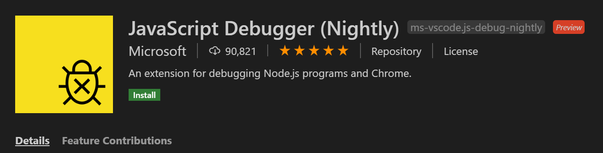
1. Go to `File -> Open Folder` and open `WebView2APISample/` (where `.vscode/` lives)
1. Open files `ScenarioJavaScripDebugIndex.js` and `ScenarioTypeScripDebugIndex.ts` from the assets folder (e.g. `WebView2APISample/assets/ScenarioJavaScripDebugIndex.js`)
1. Set breakpoints at `function OnAddClick()` in `ScenarioJavaScripDebugIndex.js` and `function OnHeaderClick()` in `ScenarioTypeScripDebugIndex.ts`
1. Go to Debug tab via `View -> Run`

##### [VSCode] Single WebView JavaScript Debugging

Test Single WebView JavaScript Debugging with **both** [Visual Studio Code's built-in debugger for Microsoft Edge](https://code.visualstudio.com/docs/nodejs/browser-debugging) and [JavaScript Debugger Nightly](https://github.com/microsoft/vscode-js-debug) in VSCode

1. Follow [Debugging Setup](#vscode-debugging-setup)
1. Go to Debug tab via `View -> Run`
1. On the top drop down, select `$(Debugger): Sample app (Script $(Configuration)|$(Platform))`. (e.g. `Debugger For Microsoft Edge: Sample app (Script Debug|x64)` and `JavaScript Debugger(Nightly): Sample app (Script Release|x64)`)
  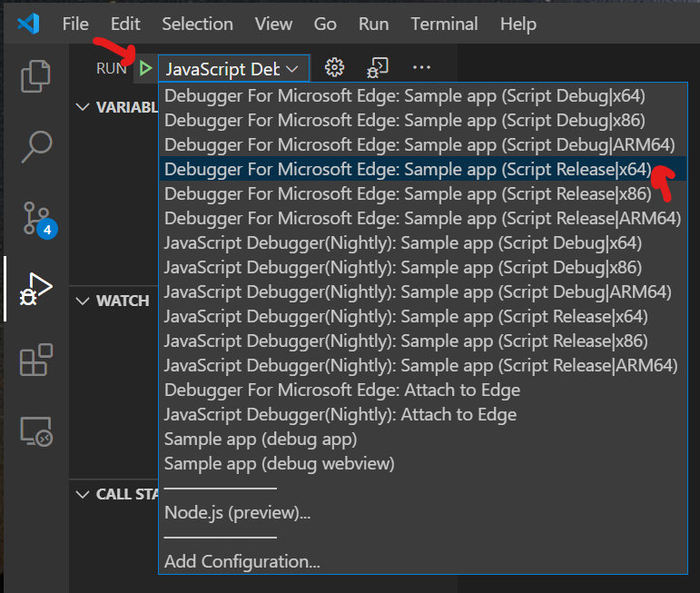
1. Press `F5` or click the green Button (GO) to Start Debugging
1. Expected: sample app is launched
1. VM\* error page may launch, just ignore and click go (Ignore VM\* file in general and click go at any stage)
1. Go to `Scenario -> Script Debugging -> JavaScript`
1. Expect debugger to hit the breakpoint and pause the page

##### [VSCode] Single WebView TypeScript Debugging

Test Single WebView TypeScript Debugging with **both** [Visual Studio Code's built-in debugger for Microsoft Edge](https://code.visualstudio.com/docs/nodejs/browser-debugging) and [JavaScript Debugger Nightly](https://github.com/microsoft/vscode-js-debug) in VSCode

1. Follow [Debugging Setup](#vscode-debugging-setup)
1. Go to Debug tab via `View -> Run`
1. On the top drop down, select `$(Debugger): Sample app (Script $(Configuration)|$(Platform))`. (e.g. `Debugger For Microsoft Edge: Sample app (Script Debug|x64)` and `JavaScript Debugger(Nightly): Sample app (Script Release|x64)`)
  
1. Press `F5` or click the green Button (GO) to Start Debugging
1. Expected: sample app is launched
1. VM\* error page may launch, just ignore and click go (Ignore VM\* file in general and click go at any stage)
1. Go to `Scenario -> Script Debugging -> TypeScript`
1. Click `Get the Current Page Header`
1. Expect debugger to hit the breakpoint and pause the page

##### [VSCode] Single WebView JavaScript Debugging Using Attach

Test Single WebView Script Debugging with **both** [Visual Studio Code's built-in debugger for Microsoft Edge](https://code.visualstudio.com/docs/nodejs/browser-debugging) and [JavaScript Debugger Nightly](https://github.com/microsoft/vscode-js-debug) in VSCode

1. Add a new REGKEY `*=--remote-debugging-port=9222` under `Computer\HKEY_CURRENT_USER\Software\Policies\Microsoft\Edge\WebView2\AdditionalBrowserArguments`
  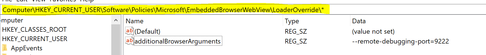
1. Follow [Debugging Setup](#vscode-debugging-setup)
1. Go to Debug tab via `View -> Run`
1. On the top drop down, select `$(Debugger): Attach to Edge`. (e.g. `Debugger For Microsoft Edge: Attach to Edge` and `JavaScript Debugger(Nightly): Attach to Edge`)
1. Press `F5` or click the green Button (GO) to Start Debugging
1. Launch `WebView2APISample.exe` from the output folder `$(Configuration)/$(Platform)/` (e.g. `Release/x64/`)
1. VM\* error page may launch, just ignore and click go. (Ignore VM\* file in general and click go at any stage).
1. Go to `Scenario -> Script Debugging -> JavaScript`
1. Click `Add a new item`
1. Expect debugger to hit the breakpoint and pause the page
1. Delete the REGKEY after testing

##### [VSCode] Single WebView TypeScript Debugging Using Attach

Test Single WebView Script Debugging with **both** [Visual Studio Code's built-in debugger for Microsoft Edge](https://code.visualstudio.com/docs/nodejs/browser-debugging) and [JavaScript Debugger Nightly](https://github.com/microsoft/vscode-js-debug) in VSCode

1. Add a new REGKEY `*=--remote-debugging-port=9222` under `Computer\HKEY_CURRENT_USER\Software\Policies\Microsoft\Edge\WebView2\AdditionalBrowserArguments`
  
1. Follow [Debugging Setup](#vscode-debugging-setup)
1. Go to Debug tab via `View -> Run`
1. On the top drop down, select `$(Debugger): Attach to Edge`. (e.g. `Debugger For Microsoft Edge: Attach to Edge` and `JavaScript Debugger(Nightly): Attach to Edge`)
1. Press `F5` or click the green Button (GO) to Start Debugging
1. Launch `WebView2APISample.exe` from the output folder `$(Configuration)/$(Platform)/` (e.g. `Release/x64/`)
1. VM\* error page may launch, just ignore and click go. (Ignore VM\* file in general and click go at any stage).
1. Go to `Scenario -> Script Debugging -> TypeScript`
1. Click `Get the Current Page Header`
1. Expect debugger to hit the breakpoint and pause the page
1. Delete the REGKEY after testing

##### [VS] Single WebView JavaScript Debugging (Debugger For Microsoft Edge)

Test Single WebView JavaScript Debugging:

1. Open VS Installer, and make sure `JavaScript Diagnostics` is installed for C++ Development Kit.
  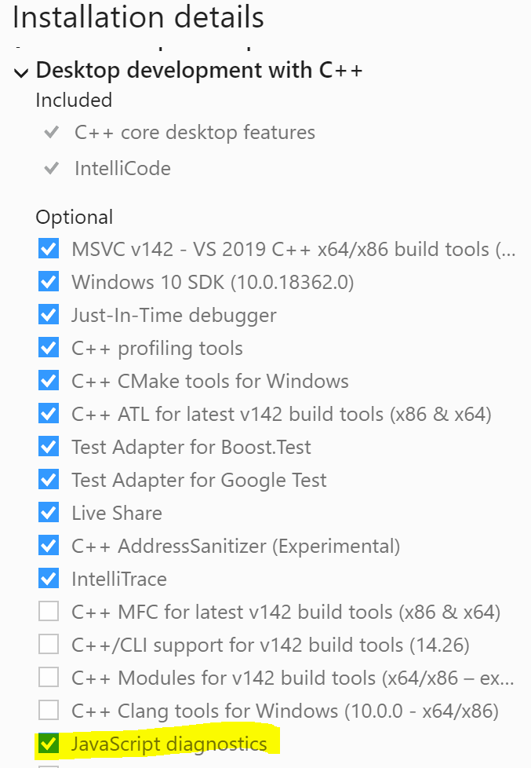
2. Open VS, go to `properties -> Debugging -> Debugger Type -> JavaScript(WebView2)`, make sure `JavaScript(WebView2)` is selected.
  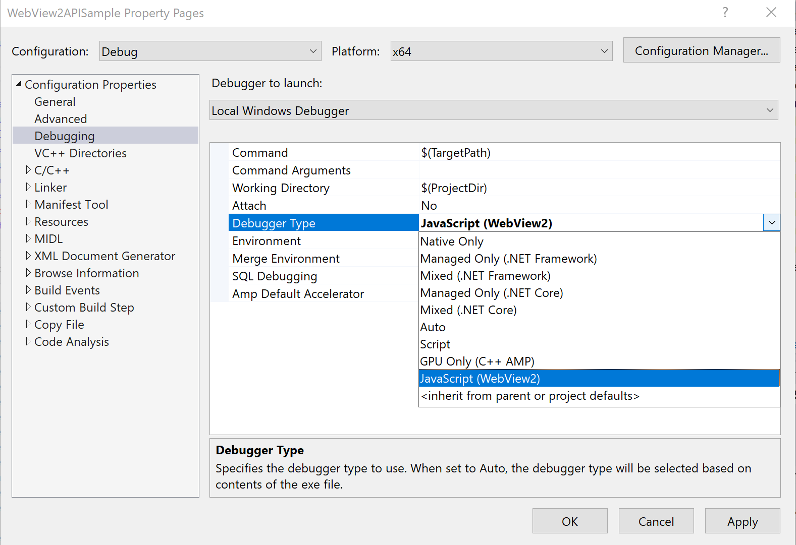
3. Go to same folder where sample app `WebView2APISample.exe` lives and open file `ScenarioJavaScripDebugIndex.js` from the same folder. Set a breakpoint on `function OnAddClick()`
4. Then launch the sample app.
5. VM\* error page may launch, just ignore and click go. (Ignore VM\* file in general and click go at any stage).
6. Go to `Scenario -> Script Debugging -> JavaScript`
7. Expect debugger to hit the breakpoint and pause the page

##### [VS] Single WebView TypeScript Debugging (Debugger For Microsoft Edge)

Test Single WebView JavaScript Debugging:

1. Open VS Installer, and make sure `JavaScript Diagnostics` is installed for C++ Development Kit.
  
2. Open VS, go to `properties -> Debugging -> Debugger Type -> JavaScript(WebView2)`, make sure `JavaScript(WebView2)` is selected.
  
3. Go to same folder where sample app `WebView2APISample.exe` lives and open file `ScenarioTypeScripDebugIndex.ts` from the same folder. Set a breakpoint on `function onHeaderClick()`
4. Then launch the sample app.
5. VM\* error page may launch, just ignore and click go. (Ignore VM\* file in general and click go at any stage).
6. Go to `Scenario -> Script Debugging -> TypeScript`
7. Click on `Get Current Page Header` button
8. Expect debugger to hit the breakpoint and pause the page

#### Cookie Management

Test that demonstrates cookie management related APIs usage such as `GetCookies`, `CreateCookie` and `AddOrUpdateCookie`, and `DeleteAllCookies`.

1. Launch the sample app
2. Go to **Scenario** > **Cookie Management**
3. Follow the instructions on the page

#### Cookie Management(Profile)

Test that demonstrates cookie management related APIs using cookie manager got from profile.

1. Launch the sample app
2. Go to **Scenario** > **Cookie Management(Profile)**
3. Follow the instructions on the page

#### NavigateWithWebResourceRequest

1. Launch sample app.
2. Go to **Scenario** > **NavigateWithWebResourceRequest**
3. On the opened dialog box enter `test` as post data and click OK.
4. Verify WebView2 navigated to `https://www.w3schools.com/action_page.php` and
   `input=test` is displayed in the text box under `Your input was received as:`.

#### ClientCertificateRequested

1. Close sample app if it is open and re-launch.
2. Go to `Scenario -> Client Certificate Requested -> Use Deferred Custom Client Certificate Selection Dialog`.
3. Expected: Message Box that says `Custom Client Certificate selection dialog will be used next when WebView2 is making a request to an HTTP server that needs a client certificate.`
4. Follow steps 8-19 from [Toggle Client Certificate Requested](#toggle-client-certificate-requested) if client certificate is not installed, otherwise skip this.
5. Navigate to <https://client.badssl.com>.
6. Expected: A custom dialog box with title `Select a certificate for authentication` and certificate/s in the list box.
7. Select a certificate from the list.
8. Expected: Certificate details (Subject, ValidFrom, ValidTo and Certificate Kind) are displayed towards right side of the list box.
9. Click `OK`.
10. Expected: Server authenticates the user and displays as below.\

11. Close sample app and re-launch.
12. Repeat steps 2-6 above.
13. Click `Cancel` in the dialog box.
14. Expected: Dialog box is closed and server responds with 400 Bad Request (No required SSL Certificate was sent).

#### SingleSignOn

1. Set environment variable WEBVIEW2_ADDITIONAL_BROWSER_ARGUMENTS=--enable-features=msSingleSignOnOSForPrimaryAccountIsShared
2. Launch sample app
3. Go to `Scenario -> WebView Event Monitor`
4. From the opened app window turn on `WebResourceRequested` switch.
5. Go to `https://www.osgwiki.com`
6. Expected: Sign on screen shows the Windows account to sign in or automatically signed in.

#### Clear Browsing Data

Test that demonstrates the clear browsing data API.

1. Launch the sample app.
2. Load <https://www.facebook.com>.
3. Go to **Scenario** > **Cookie Management**
4. Select `Get Cookies` with no URI entered.
5. Verify that there are a non-zero amount of cookies returned.
6. Click OK.
7. Go to **Scenario** > **Clear Browsing Data** > **Cookies**
8. Expected: Message Box that says `Completed`.
9. Click OK.
10. Repeat step 4.
11. Expected: Message Box that says `No cookies found.`.
12. Repeat steps 2-6.
13. Go to **Scenario** > **Clear Browsing Data** > **Download History**
14. Expected: Message Box that says `Completed`.
15. Click OK.
16. Repeat step 4.
17. Expected: the same number of cookies that were returned in step 12 are returned here.
18. Click OK.
19. Navigate to <https://rsolomakhin.github.io/autofill/> (Use this third party site to verify).
20. Enter in any test information into the Profile Autofill section and click submit.
21. Navigate to <https://rsolomakhin.github.io/autofill/>.
22. Click on the Name field.
23. Expected: A drop down box with the saved profile information is shown.
24. Go to **Scenario** > **Clear Browsing Data** > **General Autofill**
25. Click `Refresh`.
26. Click on the Name field.
27. Expected: No drop down box appears.
28. Repeat steps 19-23.
29. Go to **Scenario** > **Clear Browsing Data** > **Password Autofill**.
30. Click `Refresh`.
31. Click on the Name field.
32. Expected: A drop down box with the saved profile information is shown.

#### Print

Test that demonstrates the ShowPrintUI and Print API.

1. Launch the sample app.
2. Go to **Scenario** > **Print** > **Browser Print Preview**.
3. Verify that browser print preview dialog is displayed.
4. Click cancel.
5. Go to **Scenario** > **Print** > **System Print**.
6. Verify that system print dialog is displayed.
7. Click cancel.
8. Go to **Scenario** > **Print** > **Print to printer**.
9. On the opened dialog box enter `Microsoft Print to PDF` as the printer name and click OK.
10. Confirm file dialog is displayed.
11. Save the PDF file to a location on the machine.
12. Open and confirm that the sample app home page is printed as PDF without any background graphics.
13. Go to **Scenario** > **Print** > **Print to default printer**.
14. Repeat steps 10-12.

#### IFrame-Device-Permission

Test that demonstrates the frame Permission Requested API.

1. Launch the sample app.
2. Go to **Scenario** > **IFrame Device Permission**
3. Click `Location Test` for the nested iframe.
4. Expected: The top-level CoreWebView2Frame permission request opens a message box to ask user whether they want to accept or deny for the iframe, the CoreWebView2 PermissionRequested handler is not fired.
5. Click `Location Test` for the top level iframe.
6. Expected: The CoreWebView2Frame permission request opens a message box to ask user whether they want to accept or deny for the iframe, the CoreWebView2 PermissionRequested handler is not fired.
7. Click `Location Test` for the main frame.
8. Expected: The CoreWebView2Frame permission requests opens a message box to ask user whether they want to accept or deny.

#### Accelerator Key Pressed IsBrowserAcceleratorKeyEnabled
Test that app can allow/block specific browser accelerator keys when `IsBrowserAcceleratorKeyEnabled` settings is set to `FALSE`/`TRUE`.
1. Launch the sample app.
1. Go to `Scenario -> Accelerator Key Pressed`. F7 is expected to always be enabled and Ctr + P is always disabled in this scenario.
1. Click on `Disable all Browser Accelerator`, close pop up dialog, then reload the page.
1. Expected: All browser accelerator keys are disabled, but F7 works.
1. Click on `Enable all Browser Accelerator`, close pop up dialog, then reload the page.
1. Expected: All browser accelerator keys are now enabled, but Ctrl + P will not work.

### Help

#### About

Test that gets `About …`

1. Launch the sample app.
2. Go to `Help -> About …`
3. Expected: About Message Box that contains the sample app information.
4. Click `OK` inside the popup dialog
5. Expected: dialog closed

### Dialogs

Test that various dialogs work as expected. Uses two windows because some crashes are only caught if the app is still running.

#### Download Dialog

1. Launch the sample app.
2. Go to `Window -> Create New Thread`.
3. Expected: A new app window is opened.
4. Navigate to <https://demo.smartscreen.msft.net>.
5. Scroll down to `App Rep Demos` section and click on `Known Good Program` to download.
6. Expected: Download dialog appears.
7. Minimize app window with download dialog.
8. Restore app window with download dialog.
9. Close download dialog using `X` button.
10. Expected: Download dialog is closed.
11. Repeat step 5 to start another download.
12. Close app window with download dialog open.
13. Expected: App window and download dialog are closed.

#### Find Dialog

1. Launch the sample app.
2. Go to `Window -> Create New Thread`.
3. Expected: A new app window is opened.
4. Launch find dialog on new window with `Ctrl-F`.
5. Close new window.
6. Expected: New window and find dialog are closed.

### Dragging

#### Draggable Regions

Test that draggable regions work on WebView2.

1. Enable Draggable Regions by adding the feature flag `msWebView2EnableDraggableRegions` to `put_AdditionalBrowserArguments` args in `AppWindow::InitializeWebView`.
1. Build and launch the sample app.
1. Select `Script > Inject Script` and paste this code into the text box:

    ```javascript
    document.getElementsByClassName('header')[0].style.appRegion = "drag";
    document.getElementsByClassName('center')[0].style.appRegion = "no-drag";
    document.getElementsByClassName('header')[0].style.width = "99%";
    setTimeout(1, function() { document.getElementsByClassName('header')[0].style.width = "100%";});
    ```

NOTE: this code briefly changes the size of the 'Microsoft Edge WebView2' header
element on the webpage. This is to trigger a reflow of the document. Without
this the `appRegion` changes would not take place until some document element was resized

1. Click and drag over the text of 'Microsoft Edge WebView2' header element
1. Expected:  Cursor changes to I-bar, text highlights if applicable, sample app
   does not drag. Note: may drag if click and drag point is too far from the
   text.
1. For following instructions, click in the box, not the text of the 'Microsoft
   Edge WebView2' header element.
1. Click and drag 'Microsoft Edge WebView2' element.
1. Expected:  Entire sample app should drag
1. Double click on the 'Microsoft Edge WebView2' element.
1. Expected:  Sample app should maximize
1. Double click on the 'Microsoft Edge WebView2' element again.
1. Expected:  Sample app should restore to previous size
1. Right click on 'Microsoft Edge WebView2' element.
1. Expected: Title bar context menu (non-WebView) should appear
1. Select `maximize`
1. Expected: Sample app will maximize
1. Right click 'Microsoft Edge WebView2' element and select `restore`
1. Expected: Sample app will restore.

#### Interactive Dragging Enabled By Default

Test that interactive dragging is enabled by default on Webview2.

1. Click Scenario > Non-Client Region Support.
1. Look under the Heading "Interactive Elements".
1. Hover the mouse on the textarea and button.
1. Expected: Cursor should be arrow, the element border should turn red and
   increase in size.
1. Drag on text area and button.
1. Expected: The entire app should drag.
1. Click into text area.
1. Expected: Cursor changes to I-bar.
1. Type text into textarea then try to select/highlight it
1. Expected: Text should highlight and the entire app should not drag
1. Click button.
1. Expected: The click counter should increment.

#### Interactive Dragging Opt-out

Test that the interactive dragging opt-out switch works on Webview2.

1. run the app with the flag 
    --edge-webview-disable-interactive-dragging
1. Click Scenario > Non-Client Region Support.
1. Look under the Heading "Interactive Elements".
1. Hover the mouse on the textarea and button.
1. Expected: Cursor should be arrow, the element border should 
   stay the same.
1. Drag on text area and button.
1. Expected: The entire app should drag.
1. Click into text area.
1. Expected: Cursor remains the same.
1. Click button.
1. Expected: The click counter should not increment.

#### Drag and Drop

Test that Drag and Drop is supported in WebView2 using both hosting modes.

1. Launch the sample app.
1. Select text "Runtime version".
1. Click, hold, and drag the selected text to the Query text box.
1. Release mouse over text box to drop text.
1. Expected: "Runtime version" text is inserted into Query text box.
1. Go to `Window -> Close WebView.`
1. Go to `Window -> WebView Creation Mode -> Visual - DComp.`
1. Go to `Window -> Create WebView.`
1. Select text "Runtime version".
1. Click, hold, and drag the selected text to the Query text box.
1. Release mouse over text box to drop text.
1. Expected: "Runtime version" text is inserted into Query text box.
1. Go to `Window -> Close WebView.`
1. Expected: App does not crash.

### Hosting Modes

#### Windowed Hosting

The majority of the tests in this document are tested using Windowed/HWND hosting, which is the default.
We don't need other specific tests for Windowed Hosting.

#### Visual Hosting

Verify that basic hosting functionality continues to work when hosted using visuals.

1. Launch the sample app.
1. Go to `Window -> Close WebView`.
1. Go to `Window -> WebView Creation Mode -> Visual - DComp`.
1. Go to `Window -> Create WebView`.
1. Move mouse to the Query text box in the webpage.
1. Expected: Cursor should change from a pointer to I-beam text cursor.
1. Click in Query text box.
1. Expected: Focus moves to the text box and insertion caret shows up in the text box.
1. Type "Hello world" in the Query text box.
1. Expected: Text shows up in text box.
1. Press `Windows + period` on the keyboard.
1. Expected: Emoji picker popup appears, positioned to the bottom right of the insertion point.
1. Click on any emoji to insert it.
1. Expected: Chosen emoji is inserted in the text box.
1. Close the emoji picker.
1. Drag the window to a new location on screen.
1. Repeat steps 5 - 15.
1. Expected: Webpage moves to new location.
1. Expected: Cursor changes from hovering and clicking text box are in the new location.
1. Expected: Emoji picker is in the new location.

### Miscellaneous

#### Accelerator Key Support

Verify that accelerator key routing works

1. Launch the sample app.
2. Put focus inside the webpage.
3. For each of the following accelerator keys, press it while the webview is focused, and verify that the expected result happens.
    - `CTRL-S`: The save screenshot dialog opens.  Press cancel to close it.
    - `CTRL-N`: A new app window opens.
    - `CTRL-T`: A new app window opens.
    - `CTRL-W`: The webview inside the current app window closes.
    - `CTRL-Q`: The current app window closes.

#### Language

Verify that language and conflicting configuration works

1. Launch the sample app.
2. Right click on the page, expect that the context menu is shown in default language.
3. Go to `Window -> Create New Window`, and right click in the window, expect that the context menu is shown in default language.
4. Go to `Window -> Set WebView Language`, and set the text to `es` in the dialog and click `OK`.
5. Go to `Window -> Create WebView with redistributable`, expect an error dialog stating `Failed to create webview: 0x8007139f`.
6. Dismiss the dialog and close the app window created in step 3.
7. Go to `Window -> Set WebView Language` and set the text to `es` in the dialog and click `OK`.
8. Go to `Window -> Create WebView with redistributable`.
9. After WebView recreation, right click on the page after webview recreation, expect that the context menu is shown in Spanish.
10. Launch another instance of the sample app.
11. Expect the new instance to show a dialog stating `Failed to create webview: 0x8007139f`.

#### Saving Password

Verify that we don't offer saving password.

1. Launch the sample app.
2. Load <https://www.w3schools.com/Tags/tryit.asp?filename=tryhtml5_input_type_password>, ignore any iframe navigation failure messages during the test.
3. Type in some test email and password, like <test@example.com> and 12345678 in Email and Password field on the right part of the page.
4. Click `Submit` button, the page should show the inputted values.
5. Make sure that there is no browser prompt for saving password with strings like `Microsoft Edge will save and fill your password for this site next time`.
6. Reload the page, ignore any iframe navigation failure messages during the test.
7. Ensure that the fields are not auto filled.
8. Set focus on Email input, verify that we can choose to auto fill with previously typed in value.
9. Set focus on Password input, verify that there is no auto fill option showing up.

#### Ctrl Cick a form with post method

Verify that we correctly pass request to the new opened window when submit form with post method through ctrl click.

1. Launch the sample app.
2. Load <https://www.w3schools.com/tags/tryit.asp?filename=tryhtml_form_method_post>, ignore any iframe navigation failure messages during the test.
3. Remove `target="_blank"` from the line `<form action="/action_page.php" method="post" target="_blank">`.
4. Click `Run` button on the left part of the page.
5. Type in some test first name and last name, like first_name and last_name in First name and Last name on the right part of the page.
6. Press the Ctrl key, hold it and click `Submit` button in the meanwhile, then it should pop up a new window.
7. Verify that the text bar in the new opened window shows the first name and last name you typed in step 5, like `fname=first_name&lname=last_name`.

#### Open Link in New Window from PDF

Verify that the `NewWindowRequested` event is fired when opening a link in new window from PDF.

1. Launch the sample app.
2. Navigate to <https://appassets.example/SamplePDFWithLink.pdf>.
3. Go to `Scenario -> WebView Event Monitor` to begin tracking events.
4. Right click on the link in the PDF to open the context menu.
5. Click on 'Open link in new window'.
6. Expected: Event Monitor displays `NewWindowRequested`.

#### WebView Does Not Crash

Test that there is no crash in WebView processes for some of the error prone scenarios.

1. Launch the sample app.
1. Go to `Window -> Create New Thread`.
1. Expected:  A new app window opened.
1. Close the newly opened window by clicking on the red cross at the top right of the window.
1. Expected:  The new app window closed while no browser process failure message box is observed for the first app window.
1. Go to `Window -> Create New Thread`.
1. Expected:  A new app window opened.
1. Close the WebView in first app window by `Window -> Close WebView`.
1. Expected:  The WebView in first app window does not render the start page anymore, while no browser process failure message box is observed for the newly created app window.
1. Wait for 1 minute, expect no browser process failure message box is observed for the newly created app window.

#### HTTPS upgrades disabled for API navigations

1. Launch the sample app.
2. Navigate to `http://privacy-test-pages.site/privacy-protections/https-upgrades/`
3. Expected: Observe that the page loads on http and does not try to redirect to https
   and go into a redirect loop.
