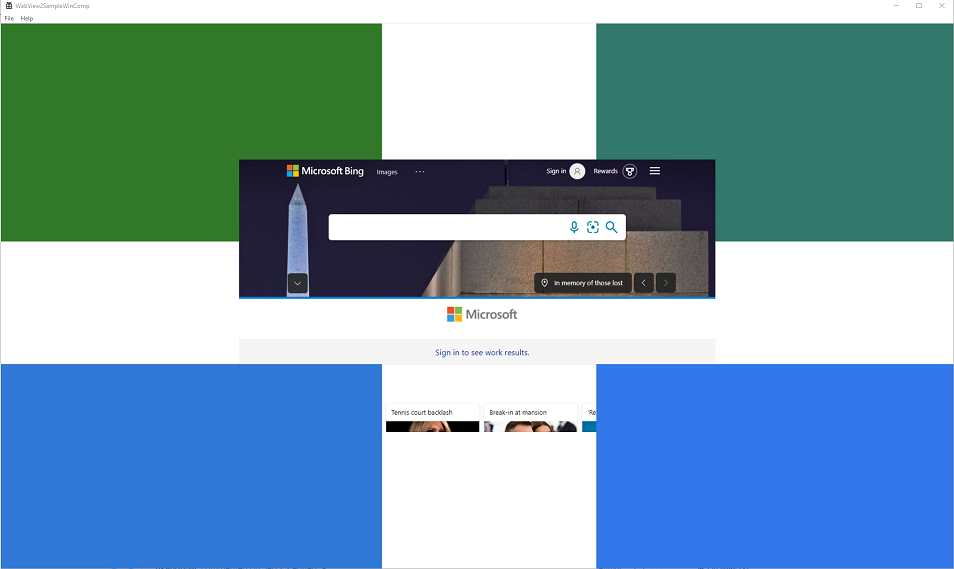

# WebView2 Sample WinComp

This is a hybrid application built with the [Microsoft Edge WebView2](https://aka.ms/webview2) control.

The WebView2SampleWinComp is an example of an application that embeds a WebView within a Win32 native application. It is built as a Win32 [Visual Studio 2019](https://visualstudio.microsoft.com/vs/) project and makes use of both C++ and HTML/CSS/JavaScript in the WebView2 environment. It also uses [Windows Runtime Composition APIs](https://docs.microsoft.com/uwp/api/windows.ui.composition?view=winrt-19041) (also called the Visual layer) to take avantage of the latest Windows 10 UI features and create better look, feel, and functionality in C++ Win32 applications.

The API Sample showcases a selection of WebView2's event handlers and API methods that allow a native Win32 application to directly interact with a WebView and vice versa.

If this is your first time using WebView, we recommend first following the [Getting Started](https://docs.microsoft.com/microsoft-edge/webview2/gettingstarted/win32) guide, which goes over how to create a WebView2 and walks through some basic WebView2 functionality.

To learn more specifics about events and API Handlers in WebView2, you can refer to the [WebView2 Reference Documentation](https://docs.microsoft.com/microsoft-edge/webview2/webview2-api-reference).

## Prerequisites

- [Microsoft Edge (Chromium)](https://www.microsoftedgeinsider.com/download/) installed on a supported OS. Currently we recommend the latest version of the Edge Canary channel.
- [Visual Studio](https://visualstudio.microsoft.com/vs/) with C++ support installed.
- Latest pre-release version of our [WebView2 SDK](https://aka.ms/webviewnuget), which is included in this project.

## Build the WebView2 Sample WinComp

Clone the repository and open the solution in Visual Studio. WebView2 is already included as a NuGet package* in this project.

- Clone this repository
- Open the solution in Visual Studio 2019**
- Set the target you want to build (Debug/Release, x86/x64/ARM64)
- Build the project file: _WebView2SampleWinComp.vcxproj_

That's it! Everything should be ready to just launch the app.

*You can get the WebView2 NugetPackage through the Visual Studio NuGet Package Manager.

**You can also use Visual Studio 2017 by changing the project's Platform Toolset in Project Properties/Configuration properties/General/Platform Toolset. You might also need to change the Windows SDK to the latest version available to you.
