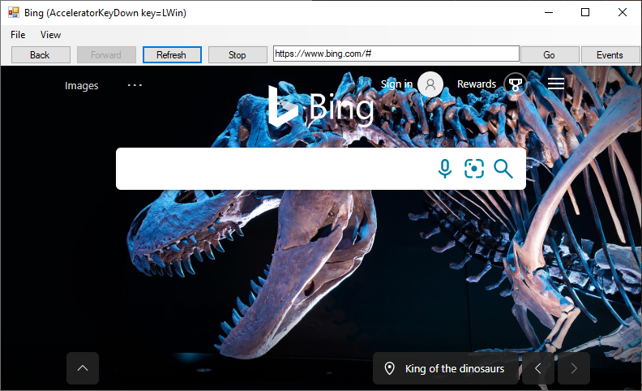

# WinForms sample app

<!-- only enough info to differentiate this sample vs the others; what is different about this sample compared to the sibling samples? -->
This sample, **WebView2WindowsFormsBrowser**, embeds a WebView within a Windows Forms application.

This sample is built as a Windows Forms Visual Studio project.  It uses C# and HTML/CSS/JavaScript in the WebView2 environment.

For more information, see [WinForms sample app](https://learn.microsoft.com/microsoft-edge/webview2/samples/webview2windowsformsbrowser).

