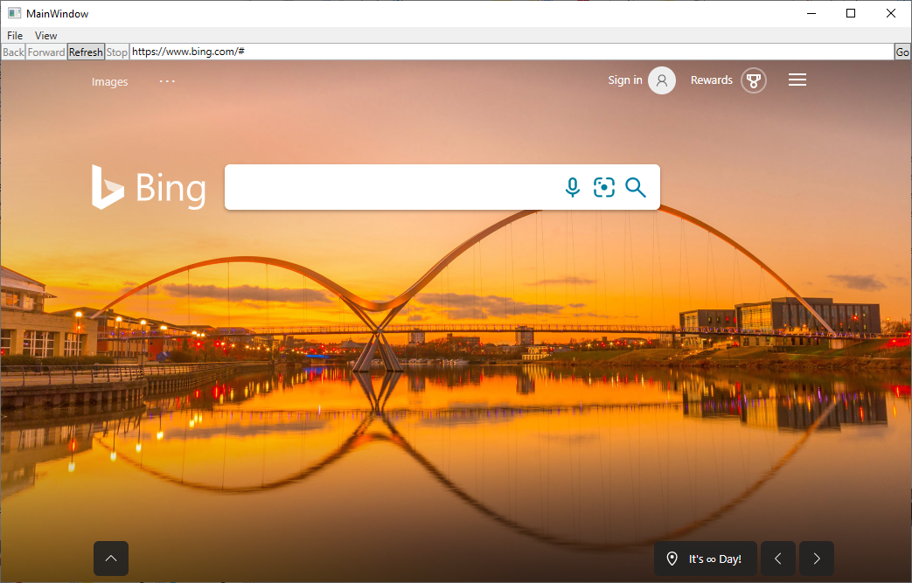

# WPF sample app

<!-- only enough info to differentiate this sample vs the others; what is different about this sample compared to the sibling samples? -->
This sample, **WebView2WpfBrowser**, embeds a WebView2 control within a WPF application.

This sample is built as a WPF Visual Studio 2019 project.  It uses C# and HTML/CSS/JavaScript in the WebView2 environment.

For more information, see [WPF sample app](https://learn.microsoft.com/microsoft-edge/webview2/samples/webview2wpfbrowser).

