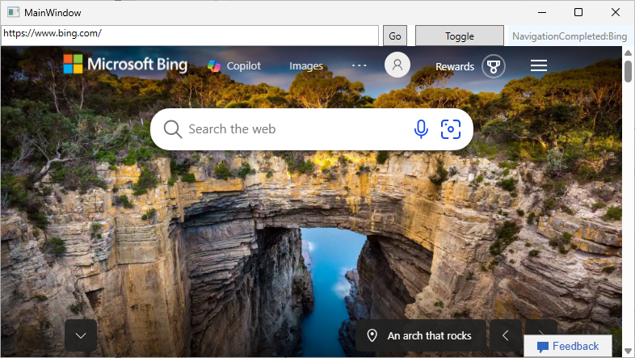

# WebView2WpfCompositionControl sample app

<!-- only enough info to differentiate this sample vs. the others; what is different about this sample compared to the sibling samples? -->

<!-- distinctive platform: -->
This sample, **WebView2WpfCompositionControl**, embeds a WPF WebView2CompositionControl within a .NET Core 3.0 and/or .NET 8 WPF application. The WebView2CompositionControl solves the WPF "Airspace" issue (where all WPF content showed up below the WebView2 in the regular WPF control) by using D3D11 graphics capture session to show and interact with WebView2 content in a regular WPF WebView2 control. In general, the WebView2CompositionControl can be used as a stand-in replacement for the regular WPF WebView2 control.

<!-- screenshot of running sample app: -->

