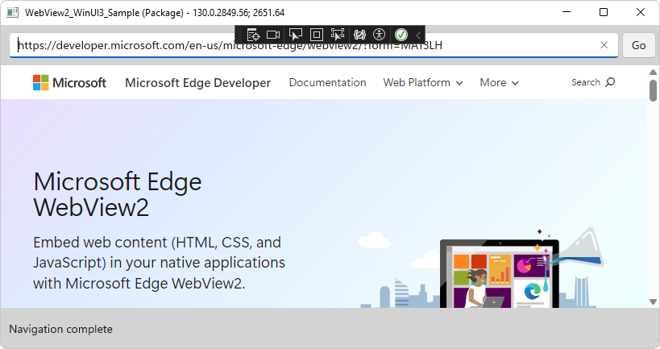

# WinUI 3 (Windows App SDK) sample app

This sample (**WebView2_WinUI3_Sample**) demonstrates using a WebView2 control in a WinUI 3 (Windows App SDK) Packaged application.

This sample also allows you to ship the app with a fixed-version WebView2 Runtime, instead of using whichever version of the WebView2 Runtime is installed and running on the user's computer.

To use this sample, see [WinUI 3 (Windows App SDK) sample app](https://learn.microsoft.com/microsoft-edge/webview2/samples/webview2-winui3-sample).
