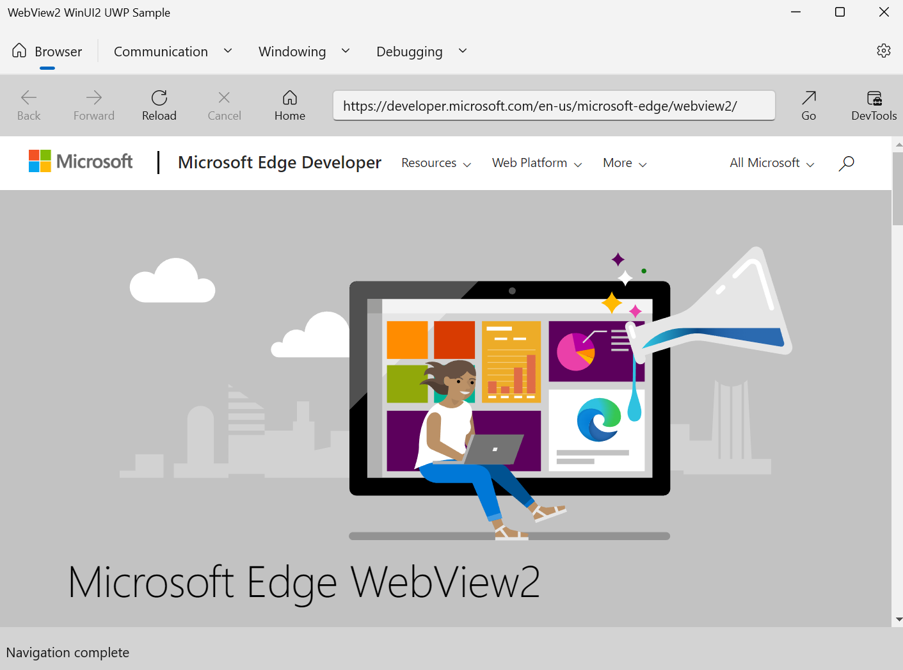

# WinUI 2 (UWP) sample app

<!-- only enough info to differentiate this sample vs the others; what is different about this sample compared to the sibling samples? -->
This sample, **webview2_sample_uwp**, embeds a WebView2 control within a WinUI 2 (UWP) app.

This sample is built as a UWP Visual Studio 2019 project.  It uses C++ and HTML/CSS/JavaScript in the WebView2 environment.

For more information, see [WinUI 2 (UWP) sample app](https://learn.microsoft.com/microsoft-edge/webview2/samples/webview2_sample_uwp).

