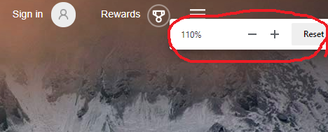

# WebView2 API Testing Instructions

These are instructions for manually testing all the features of the WebView2 API using the WebView2APISample app.

## Table Of Contents

* [Getting started](#Getting-started)
    * [Install a NuGet package Locally in VS](#Install-a-NuGet-package-Locally-in-VS)
* [UI Entries](#UI_Entries)
    * [File](#File)
        * [Save Screenshot](#Save-Screenshot)
        * [Get Document Title](#Get-Document-Title)
        * [Get Browser Version After Creation](#Get-Browser-Version-After-Creation)
        * [Get Browser Version Befor Creation](#Get-Browser-Version-After-Creation)
        * [Exit](#Exit)
    * [Script](#Script)
        * [Inject Script](#Inject-Script)
        * [Post Message String](#Post-Message-String)
        * [Post Message JSON](#Post-Message-JSON)
        * [Add Initialize Script](#Add/Remove-Initialize-Script)
        * [Remove Initialize Script](#Add/Remove-Initialize-Script)
        * [Subscribe to CDP event](#Subscribe-to-CDP-event-&-Call-CDP-method)
        * [Call CDP method](#Subscribe-to-CDP-event-&-Call-CDP-method)
        * [Add COM Object](#Add-COM-Object)
        * [Open DevTools Window](#Open-DevTools-Window)
    * [Window](#Window)
        * [Close WebView](#Close-WebView)
        * [Create WebView](#Create-WebView)
        * [Create New Window](#Create-New-Window)
        * [Create New Thread](#Create-New-Thread)
    * [Process](#Process)
        * [Browser Process Info](#Browser-Process-Info)
        * [Crash Browser Process](#Crash-Browser-Process)
        * [Unresponsive Browser Process](#Unresponsive-Browser-Process)
    * [Setting](#Setting)
        * [Blocked Domains](#Blocked-Domains)
        * [Set User Agent](#Set-User-Agent)
        * [Toggle JavaScript](#Toggle-JavaScript)
        * [Toggle Web Messaging](#Toggle-Web-Messaging)
        * [Toggle Fullscreen allowed](#Toggle-Fullscreen-allowed)
        * [Toggle Status Bar enabled](#Toggle-Status-Bar-enabled)
        * [Toggle DevTools enabled](#Toggle-DevTools-enabled)
        * [Toggle ZoomControl enabled](#Toggle-ZoomControl-enabled)
        * [Toggle Block images](#Toggle-Block-images)
        * [JavaScript Dialogs](#JavaScript-Dialogs)
        * [Toggle context menus enabled](#Toggle-context-menus-enabled)
        * [Toggle builtin error page enabled](#Toggle-builtin-error-page-enabled)
    * [View](#View)
        * [Toggle Visibility](#Toggle-Visibility)
        * [WebView Area](#WebView-Area)
        * [WebView Zoom](#WebView-Zoom)
        * [WebView Scale](#WebView-Scale)
        * [Set Focus](#Set-Focus)
        * [Tab In](#Tab-In)
        * [Reverse Tab In](#Reverse-Tab-In)
        * [Toggle Tab Handling](#Toggle-Tab-Handling)
    * [Scenario](#Scenario)
        * [Web Messaging](#Web-Messaging)
        * [Add Remote Object](#Add-Remote-Object)
    * [Help](#Help)
        * [About ...](#About-...)
    * [Miscellaneous](#Miscellaneous)
        * [Accelerator Key Support](#Accelerator-Key-Support)
        * [Language](#Language)

## Getting started
* Install the [latest Edge Canary Channel](https://www.microsoftedgeinsider.com/en-us/download)

### Install a NuGet package Locally in VS
1. Open Visual Studio
2. Go to `View -> Other Windows -> Package Manager Console`
3. Select `WebView2APISample` as Default project
4. Run:
    ```
    Install-Package <NuGet package file path>
    ```
5. Press `F5` to build and run the app.

## UI Entries

### File

#### Save Screenshot
Test that captures and saves a screenshot
1. Launch the sample app.
2. Go to `File -> Save Screenshot`
3. Expected: A file selection dialog with default file name `WebView2_Screenshot`, then save the screenshot of the WebView to the selected file
4. Expected: Preview Captured Message Box that says `Preview Captured`
5. Click `OK`

#### Get Document Title
Test that gets Document Title
1. Launch the sample app.
2. Go to `File -> Get Document Title`
3. Expected: Document Title Message Box that says `Bing`.
4. Click `OK` inside the popup dialog
5. Expected: dialog closed

#### Get Browser Version After Creation
Test that gets browser version after webview creation
1. Launch the sample app.
2. Go to `File -> Get Browser Version After Creation`
3. Expected: Message Box that contains browser version and channel name (if not stable) after WebView creation
4. Click `OK` inside the popup dialog
5. Expected: dialog closed

#### Get Browser Version Before Creation
Test that gets installed browser version before webview creation
1. Launch the sample app.
2. Go to `File -> Get Browser Version Before Creation`
3. Expected: Message Box that contains browser version and channel name (if not stable) before WebView creation
4. Click `OK` inside the popup dialog
5. Expected: dialog closed

#### Exit
Test that exits the sample app
1. Launch the sample app.
2. Go to `File -> Exit`
3. Expected: App Window and WebView closed

### Script

#### Inject Script
Test that prompts the user for some script to run in the WebView
1. Launch the sample app.
2. Go to `Script -> Inject Script`
3. Expected: Text Input Dialog that prompts the user for JavaScript code to execute in the current top level document rendered in the WebView
4. Click `Cancel`
5. Repeat steps 2-3
6. Type `confirm("Confirm?")` in the text input box and click `OK`
7. Expected: Confirm Box popup that says `Confirm?`
8. Click `OK` inside the Confirm Box
9. Expected: ExecuteScript Result popup that says `true`
10. Click `OK` inside the popup dialog
11. Expected: dialog closed

#### Post Message string
Test that prompts the user for some string web message to the top level document
1. See [Web Messaging](#Web-Messaging)

#### Post Message JSON
Test that prompts the user for some JSON web message to the top level document
1. See [Web Messaging](#Web-Messaging)

#### Add/Remove Initialize Script
Test that prompts the user for some script to run as the initialization script
Test that prompts the user for the ID of the initialize scripts that the user would like to remove
_Scripts are executed after the global object has been created and before the HTML document has been parsed every navigation_
1. Launch the sample app.
2. Go to `Script -> Add Initialize Script`
3. Expected: Text Input Dialog that prompts the user for some JavaScript
4. Click `Cancel`
5. Repeat steps 2-3
6. Type `alert("Hello World!")` and click `OK`
7. Expected: Message Box with title `AddScriptToExecuteOnDocumentCreated ID` that contains the Script ID (e.g. 2)
8. Click `OK` inside the popup dialog and click `Reload`
9. Expected: Alert Box popup that says `Hello World!`
10. Click `OK` inside the Alert Box
11. Load https://aka.ms/webview2
12. Repeat steps 9-10
13. Go to `Script -> Remove Initialize Script`
14. Expected: Text Input Dialog that prompts the user for Script ID
15. Click `Cancel`
16. Repeat steps 13-14
17. Type the Script ID from step 7 (e.g. 2) and click `OK`
18. Click `Reload`
19. Expected: No more Alert Box popup

#### Subscribe to CDP event & Call CDP method
Test that prompts the user for the name of the CDP event to subscribe to
Test that prompts the user for the CDP method name to call
1. Launch the sample app.
2. Go to `Script -> Call CDP method`
3. Expected: Text Input Dialog that prompts the user for the CDP method name (and parameters, if any) to call
4. Click `Cancel`
5. Repeat steps 2-3
6. Type `Page.enable` and click `OK`
7. Expected: CDP Method Resutl Message Box that says `{}`
8. Go to `Script -> Subscribe to CDP event`
9. Expected: Text Input Dialog that prompts the user for the name of the CDP event to subscribe to
10. Click `Cancel`
11. Repeat steps 7-8
12. Type `Page.javascriptDialogClosed` and click `OK`
13. Go to `Script -> Inject Script` and inject JavaScript `alert("Open!")`
14. Expected: Alert Box popup that says `Open!`
15. Click `OK` inside the Alert Box
16. Expected: Message Box with title `CDP Event Fired: Page.javascriptDialogClosed` that says `{"result":true,"userInput":"}` and ExecuteScript Result popup that says `null` (Side effect of `Script -> Inject Script`)
17. Click `OK` inside both popup dialogs

#### Open DevTools Window
Test that open DevTools in WebView window
1. Launch the sample app.
2. Go to `View -> Open DevTools Window`
3. Expected: DevTools Window to pop up

### Window

#### Close WebView
Test that closes WebView
1. Launch the sample app.
2. Go to `Window -> Close WebView`
3. Expected: WebView closed.

#### Create WebView
Test that creates WebView with installed edge
1. Launch the sample app.
2. Go to `Window -> Create WebView`
3. Expected: WebView created with installed Edge

#### Create New Window
Test that creates new window
1. Launch the sample app.
2. Go to `Window -> Create New Window`
3. Expected: A new app window opened on the same thread

#### Create New Thread
Test that opens a new app window on a new thread
1. Launch the sample app.
2. Go to `Window -> Create New Thread`
3. Expected:  A new app window opened on a new thread

### Process

#### Browser Process Info
Test that gets browser process information
1. Launch the sample app.
2. Go to `Process -> Browser Process Info`
3. Expected: Process Info Message Box that contains the browser process ID
4. Click `OK` inside the popup dialog
5. Expected: The dialog closed

#### Crash Browser Process
Test browser process going away unexpectedly
1. Launch the sample app. 
2. Go to `Process -> Crash Browser Process`
3. Expected: Error dialog popup that says `Browser process exited unexpectedly. Recreate webview?`\
  
4. Click `Yes` inside the Popup dialog
5. Expected: The content from https://www.bing.com rendered inside the app, just like after step  1 above\
  
6. Repeat step 2-3, then click `No` inside the popup dialog
7. Expected: blank content inside the app\
  

#### Unresponsive Browser Process
Test browser process becoming unresponsive
1. Launch the sample app. 
2. Navigate to `edge://hang`.
3. Wait ~20-30 seconds.
4. Expected: Error dialog popup that says `Browser renderer process stopped responding. Recreate webview?`\
  \
  Note: 'This page isn't responding' dialog does not display if the hang is triggered via injecting script: `while (1) { console.log('hang') }`
5. Click `Yes` inside the Popup dialog
6. Expected: The app window resets to the same state as step 1.

### Settings

#### Blocked Domains
Test that prompts user for sites to block\
_It includes foo.com and bar.org by default_
1. Launch the sample app.
2. Load https://www.microsoft.com
3. Go to `Settings -> Blocked Domains`
4. Expected: Text Input Dialog that prompts the user for a list of blocked domains
5. Add www.bing.com to the list of blocked domains and click `OK`
6. Load https://www.bing.com
7. Expected: Navigation to https://www.bing.com fails
8. Repeat steps 3-4
9. Remove www.bing.com from the list of blocked domains and click `OK`
10. Repeat step 6
11. Expected: Navigation to https://www.bing.com completes

#### Set User Agent
Test that prompts the user for a new user agent string and sets user agent\
_It only modifies the header for HTTP. Change won't be reflected if checked with `navigator.userAgent`_
1. Launch the sample app.
2. Go to `Settings -> Set User Agent`
3. Expected: Text Input Dialog that prompts the user for the user agent
4. Click `Cancel`
5. Repeat steps 2-3
6. Type `WebView Agent` and click `OK`
7. Load https://www.whatismybrowser.com/detect/what-is-my-user-agent (Use this third party site to verify)
8. Expected: See that User Agent is modified to `WebView Agent` accordingly
9. Repeat steps 2-3
10. Leave the input box blank to restore to default user agent and click `OK`
11. Expected: See that User Agent is restored to default

#### Toggle JavaScript
Test that enables/disables JavaScript\
_It is enabled by default. `Script -> Inject Script` won't be affected if disabled._
1. Launch the sample app.
2. Expected: The JavaScript elements on https://www.bing.com are rendered accordingly
3. Go to `Settings -> Toggle JavaScript`
4. Expected: Message Box that says `JavaScript will be disabled after the next navigation.`
5. Click `OK` inside the popup dialog and click `Reload`
6. Expected: The JavaScript elements on https://www.bing.com are disabled
7. Repeat step 3
8. Expected: Message Box that says `JavaScript will be enabled after the next navigation.`
9. Repeat step 5
10. Expected: The JavaScript elements on https://www.bing.com are rendered again

#### Toggle Web Messaging
Test that enables/disables web messaging\
_It is enabled by default._
1. Launch the sample app.
2. Go to `Scenario -> Web Messaging`
3. Go to `Settings -> Toggle Web Messaging`
4. Expected: Message box that says `Web Messaging will be disabled after the next navigation.`
5. Click `OK` inside the popup dialog and click `Reload`
6. Expected: Scenario in section `Posting Messages` wouldn`t work
7. Repeat step 3
8. Expected: Message box that says `Web Messaging will be enabled after the next navigation.`
9. Repeat step 5
10. Expected: Scenario in section `Posting Messages` works as described

#### Toggle Fullscreen allowed
Test the allows/disallows Fullscreen mode\
_It is allowed by default._
1. Launch the sample app.
2. Load [this sample video](https://www.youtube.com/watch?v=JE8KNQFwMzE&feature=youtu.be&t=943) and request it in full screen mode
3. Expected: The video element is allowed to be displayed full screen
4. Go to `Settings -> Toggle Fullscreen allowed`
5. Expected: Message box that says `Fullscreen is now disallowed.`
6. Click `OK`
7. Repeat step 2
8. Expected: The video element will fill the WebView bounds
9. Repeat step 4
10. Expected: Message box that says `Fullscreen is now allowed.`
11. Repeat steps 6-7
12. Expected: The video element is allowed to be displayed full screen again

#### Toggle Status Bar enabled
Test that enables/disables Status Bar\
_It is enabled by default._
1. Launch the sample app.
2. Hover the cursor to the `Images` tab on https://www.bing.com
3. Expected: See status bar at the bottom left corner
4. Go to `Settings -> Toggle Status Bar enabled`
5. Expected: Message box that says `Status bar will be disabled after the next navigation.`
6. Click `OK` inside the popup dialog and click `Reload`
7. Repeat step 2
8. Expected: Status bar becomes unavailable
9. Repeat step 4
10. Expected: Message box that says `Status bar will be enabled after the next navigation.`
11. Repeat steps 6-7
12. Expected: Status bar comes back up the bottom left corner


#### Toggle DevTools enabled
Test that enables/disables DevTools\
_It is enabled by default._
1. Launch the sample app.
2. Right-click the mouse
3. Expected: `Inspect` option available in the Right Click Menu
4. Go to `Settings -> Toggle DevTools enabled`
5. Expected: Message Box that says `Dev tools will be disabled after the next navigation.`
6. Click `OK` inside the popup dialog and click `Reload`
7. Right-click the mouse
8. Expected: `Inspect` option disappears in the Right Click Menu
9. Repeat step 4
10. Expected: Message Box that says `Dev tools will be enabled after the next navigation.`
11. Click `OK` inside the popup dialog and click `Reload`
12. Right-click the mouse
13. Expected: `Inspect` option available in the Right Click Menu again

#### Toggle ZoomControl enabled ####
Test that enables/disables Zoom\
_It is enabled by default._
1. Launch the sample app.
2. Ctrl+ +/- or mouse wheel
3. Expected: The Webview zooms in and out, ZoomView shown below shouldn't show up:\

4. Go to `Settings -> Toggle zoom control enabled`
5. Expected: Message Box that says `Zoom control will be disabled after the next navigation.`
6. Click `OK` inside the popup dialog and click `Reload`
7. Ctrl+ +/- or mouse wheel
8. Expected: The Webview doesn't zoom in or out, nor ZoomView shows up
9. Go to `Settings -> Toggle zoom control enabled`
10. Expected: Message Box that says `Zoom control will be enabled after the next navigation.`
11. Verify that zooming works again with ZoomView showing up

#### Toggle Block images
Test that enables/disables image blocking\
_It is disabled by default. Data URI won't e affected if disabled._
1. Launch the sample app.
2. Go to `Settings -> Toggle Block images`
3. Expected: Message Box that says `Image blocking has been enabled.`
4. Click `OK` inside the popup dialog
5. Scroll down to load more content
6. Expected: Images are blocked except for those that are already cached
7. Repeat step 2
8. Expected: Message Box that says `Image blocking has been disabled.`
9. Click `OK` inside the popup dialog and click `Reload`
10. Expected: No images are blocked

#### JavaScript Dialogs
Tests JavaScript Dialogs with different configurations
1. Launch the sample app
2. Go to `Settings -> JavaScript Dialogs -> Use Custom Script Dialogs`
3. Expected: Message Box that says `Custom script dialogs without deferral will be used after the next navigation.`
4. Click `OK` inside the popup dialog and click `Reload`
5. Go to `Script -> Inject Script` and inject JavaScript `alert()`
6. Expected: Custom Alert Box popup\
  
7. Make sure the default JavaScript Dialog does not show\
  
8. Click `OK` inside the Alert Box
9. Expected: ExecuteScript Result popup that says `null`
10. Go to `Settings -> JavaScript Dialogs -> Use Deferred Script Dialogs`
11. Expected: Message Box that says `Custom script dialogs with deferral will be used now.`
12. Repeat step 5
13. Expected: Nothing popups and WebView is frozen
14. Go to `Setting -> JavaScript Dialogs -> Complete Deferred Script Dialog`
15. Expected: Custom Alert Box popup
16. Click `OK` inside the Alert Box
17. Expected: ExecuteScript Result popup that says `null`
18. Go to `Settings -> JavaScript Dialogs -> Use Default Script Dialogs`
19. Expected: Message Box that says `Default script dialogs will be used after the next navigation.`
20. Click `OK` inside the popup dialog and click `Reload`
21. Repeat step 5
22. Expected: Default Alert Box popup
23. Click `OK` inside the Alert Box
24. Expected: ExecuteScript Result popup that says `null`

#### Toggle context menus enabled
Test that enables/disables context menu blocking\
_Context menus are enabled by default._
1. Launch the sample app.
2. Go to `Settings -> Toggle context menus`
3. Expected: Message Box that says `Context menus will be disabled after next navigation.`
4. Click `OK` inside the popup dialog and click `Reload`
5. Right click on reloaded page
6. Expected: Nothing happens, no context menu shows up.
7. Go to `Settings -> Toggle context menus`
8. Expected: Message Box that says `Context menus will be enabled after next navigation.`
9. Click `OK` inside the popup dialog and click `Reload`
10. Right click on reloaded page.
11. Expected: Context menu shows up

#### Toggle builtin error page enabled
Test that enables/disables built-in error page\
_Builtin error page is enabled by default._
1. Launch the sample app.
2. Go to `Settings -> Toggle built-in error page enabled`
3. Expected: Message Box that says `Built-in error page will be disabled for future navigation.`
4. Click `OK` inside the popup dialog
5. Try navigate to https://www.bingaaa.com/
6. Expected: blank page is shown
7. Go to `Process -> Crash Render Process`
8. Expected: WebView shows blank page and a dialog that says `Browser render process exited unexpectedly. Reload page?`
9. Click `Yes` in the popup dialog, expect webview to reload and stay as blank
10. Go to `Settings -> Toggle built-in error page enabled`
11. Expected: Message Box that says `Built-in error page will be enabled for future navigation.`
12. Click `OK` inside the popup dialog and click `Reload` button
13. Expected: error page is shown with `Hmmm… can't reach this page`
14. Go to `Process -> Crash Render Process`
15. Expected: error page is shown with `This page is having a problem` and a dialog that says `Browser render process exited unexpectedly. Reload page?`
16. Click `No` in the popup dialog, expect webview to stay at the error page

### View

#### Toggle Visibility
Test that makes WebView visible/invisible
1. Launch the sample app.
2. Go to `View -> Toggle Visibility`
3. Expected: The WebView becomes invisible
4. Repeat step 2
5. Expected: The WebView becomes visible

#### WebView Area
Test that resizes WebView window\
_Updates the bounds of the WebView window to resize_
1. Launch the sample app.
2. Go to `View -> WebView Area -> Get WebView Bounds`. Note the current bounds.
3. Go to `View -> WebView Area -> 25%`
4. Go to `View -> WebView Area -> Get WebView Bounds`.
5. Expected: WebView size ratio is 25% of bounds in step 2 and WebView was resized.
6. Go to `View -> WebView Area -> 50%`
7. Go to `View -> WebView Area -> Get WebView Bounds`.
8. Expected: WebView size ratio to 50% of bounds in step 2 and WebView was resized.
9. Go to `View -> WebView Area -> 100%`
10. Go to `View -> WebView Area -> Get WebView Bounds`.
11. Expected: WebView size matches bounds in step 2 and WebView was resized.

#### WebView Zoom
Test that zooms in/out WebView\
_WebView maintains host set zoom factor across navigations_
1. Launch the sample app.
2. Go to `View -> WebView Zoom -> 0.5x`
3. Go to `View -> WebView Zoom -> Get WebView Zoom`
4. Expected: WebView zoom factor is set to 0.5x
5. Click inside the WebView, then type ctrl+ +.
6. Go to `View -> WebView Zoom -> Get WebView Zoom`
7. Expected: WebView zoom factor is set to .66x
8. Load https://www.google.com
9. Go to `View -> WebView Zoom -> Get WebView Zoom`
10. Expected: WebView zoom factor is set to .5x
11. Go to `View -> WebView Zoom -> 2x`
12. Go to `View -> WebView Zoom -> Get WebView Zoom`
13. Expected: WebView zoom factor is set to 2x
14. Click `Back`
15. Go to `View -> WebView Zoom -> Get WebView Zoom`
16. Expected: WebView zoom factor is set to 2x

#### WebView Scale
Test scaling the WebView.\
_Scale is a resize and zoom that happens atomically. It results in the WebView
getting larger or smaller without the layout of the page changing._
1. Launch the sample app.
2. Go to `View -> WebView Area -> 50%`
2. Go to `View -> WebView Area -> Get WebView Bounds`. Note the current bounds.
3. Go to `View -> WebView Scale -> 1.5x`
4. Go to `View -> WebView Area -> Get WebView Bounds`
5. Expected: WebView size is 1.5x larger than bounds in step 2.
6. Go to `View -> WebView Zoom -> Get WebView Zoom`
7. Expected: WebView zoom factor is set to 1.5x
8. Expected: WebView renders at the new size/zoom (looks larger) without the
   layout of the page changing (elements are still in the same position relative
   to other elements).

#### Set Focus
Test that sets focus into WebView
1. Launch the sample app.
2. Click on the Bing address bar and press `Tab` key once, which sets the focus to the camera icon
3. Click `Cancel` in the app window, which moves the focus from the WebView to the app window
4. Go to `View -> Set Focus`
5. Expected: See the focus is moved back the camera icon, which was the last focus in the WebView

#### Tab In
Test that moves focus due to Tab traversal forward
1. Launch the sample app.
2. Go to `View -> Tab In`
3. Expected: See the focus is set to the Bing search bar (the first element) in the WebView

#### ReverseTab In
Test that moves focus due to Tab traversal backward
1. Launch the sample app and load https://www.google.com
2. Go to `View -> Reverse Tab In`
3. Expected: See the focus is set to `How Search works` in Google (the last element).

#### Toggle Tab Handling
Test that enables/disables tab handling\
_It is disabled by default. Tabbing behavior should be identical whether this is enabled or disabled._

1. Launch the sample app and load https://www.google.com
2. Click address bar
3. Press `Tab` twice (-> `Go` -> first element in WebView)
4. Expected: See the focus is set to `About` in Google (the first element) in the WebView.
5. Press `Shift+Tab`
6. Expected: See the focus is set to `Go` with the dotted line.
7. Press `Shift+Tab` 4 times (-> address bar -> `Cancel` -> `Reload` -> last element in WebView)
8. Expected: See the focus is set to the `How Search works` in Google (the last element) with the dotted line in the WebView.
9. Press `Tab`
10. Expected: See the focus is set to `Reload` with the dotted line.
11. Go to `View -> Toggle Tab Handling` (Enabling Tab Handling)
12. Repeat steps 2-10 above.

### Scenario

#### Web Messaging
Test that demonstrates basic interaction between the host app and the WebView by means of Web Messages
Menu items `Script -> Post Message String` & `Script -> Post Message JSON` are demonstrated.
1. Launch the sample app.
2. Go to `Scenario -> Web Messaging`
3. Follow the instructions on the page

#### Add Remote Object
Test that demonstrates basic interaction between the host app and the WebView by means of Web Messages
Menu item `Script -> Add Remote Object` is demonstrated.
1. Launch the sample app.
2. Go to `Scenario -> Add Remote Object`
3. Follow the instructions on the page

### Help

#### About ...
Test that gets `About …`
1. Launch the sample app.
2. Go to `Help -> About …`
3. Expected: About Message Box that contains the sample app information.
4. Click `OK` inside the popup dialog
5. Expected: dialog closed

### Miscellaneous

#### Accelerator Key Support
Verify that accelerator key routing works
1. Launch the sample app.
2. Put focus inside the webpage.
3. For each of the following accelerator keys, press it while the webview is focused, and verify that the expected result happens.
    * `CTRL-S`: The save screenshot dialog opens.  Press cancel to close it.
    * `CTRL-N`: A new app window opens.
    * `CTRL-T`: A new app window opens.
    * `CTRL-W`: The webview inside the current app window closes.
    * `CTRL-Q`: The current app window closes.

#### Language
Verify that language and conflicting configuration works
1. Launch the sample app.
2. Right click on the page, expect that the context menu is shown in default language.
3. Go to `Window -> Create New Window`, and right click in the window, expect that the context menu is shown in default language.
4. Go to `Window -> Set WebView Language`, and set the text to `es` in the dialog and click `OK`.
5. Go to `Window -> Create WebView with redistributable`, expect an error dialog stating `Failed to create webview: 0x8007139f`.
6. Dismiss the dialog and close the app window created in step 3.
7. Go to `Window -> Set WebView Language` and set the text to `es` in the dialog and click `OK`.
8. Go to `Window -> Create WebView with redistributable`.
9. After WebView recreation, right click on the page after webview recreation, expect that the context menu is shown in Spanlish.
10. Launch another instance of the sample app.
11. Expect the new instance to show a dialog stating `Failed to create webview: 0x8007139f`.
